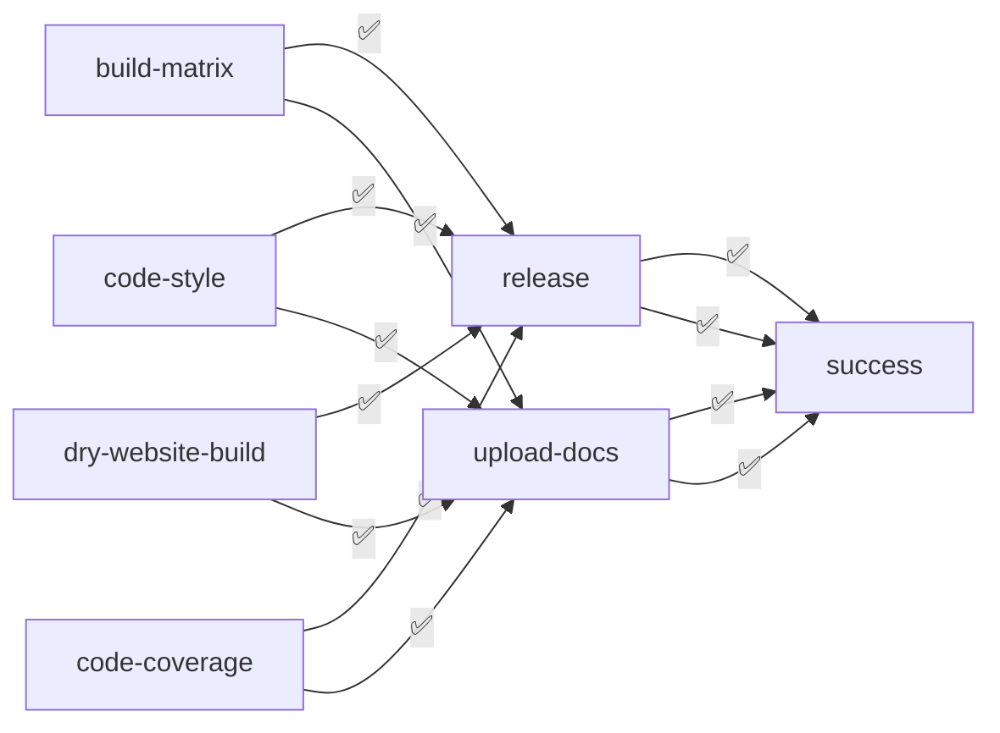

# Build automation e Continuous Integration (CI)

## Build automation

Lo strumento utilizzato per la build automation è **sbt**.

Questo ha permesso di gestire le dipendenze del progetto, compilare il codice, eseguire i test e generare la
documentazione in modo automatizzato. I numerosi plugin disponibili hanno facilitato la gestione e il monitoraggio della
qualità del codice.

### Code quality

Per garantire la qualità del codice, sono stati utilizzati i seguenti plugin:

- **scalafmt**: formattazione automatica del codice secondo le convenzioni di stile Scala;
- **scalafix e wartremover**: analisi statica del codice per identificare potenziali problemi e migliorare la qualità
  del codice;
- **jaCoCo**: generazione dei report di copertura del codice, permettendo di monitorare la percentuale di
  codice testato e identificare le aree da migliorare.

## Continuous Integration (CI)

Per la Continuous Integration (CI), è stato utilizzato **GitHub Actions**.

Questo strumento ha permesso di automatizzare il processo di integrazione continua, eseguendo automaticamente i test e
le build del progetto a ogni push o pull request.
Le azioni configurate sono:

- **build**: compila il codice ed esegue i test;
- **code-style**: verifica la conformità agli standard di stile e qualità definiti;
- **code-coverage**: genera report di copertura e carica i risultati su [Coveralls (PPS-22-srs)](https://coveralls.io/github/Scala-Robotics-Simulator/PPS-22-srs);
- **dry-website-build**: verifica che il sito web generato dalla documentazione sia corretto e privo di errori;
- **release**: gestisce le release creando automaticamente tag e pubblicando le versioni su GitHub;
- **upload-docs**: carica la documentazione generata su GitHub Pages, rendendola disponibile online;
- **success**: controlla che tutte le azioni siano state eseguite con successo e notifica eventuali errori.

### Deployment

Il deployment del sito web generato dalla documentazione è automatizzato con GitHub Actions, la quale pubblica su GitHub
Pages a ogni push su `main`. Questo ha garantito che la documentazione fosse sempre aggiornata e accessibile agli utenti.

Il deployment dell’applicazione avviene al termine di ogni sprint richiamando manualmente il workflow di **release**, che crea un
tag e una release su GitHub, genera il file `JAR` e lo pubblica nella sezione “Releases” del repository. Questo processo
consente di mantenere una versione stabile e facilmente distribuibile, pronta per l’uso da parte degli utenti finali.
