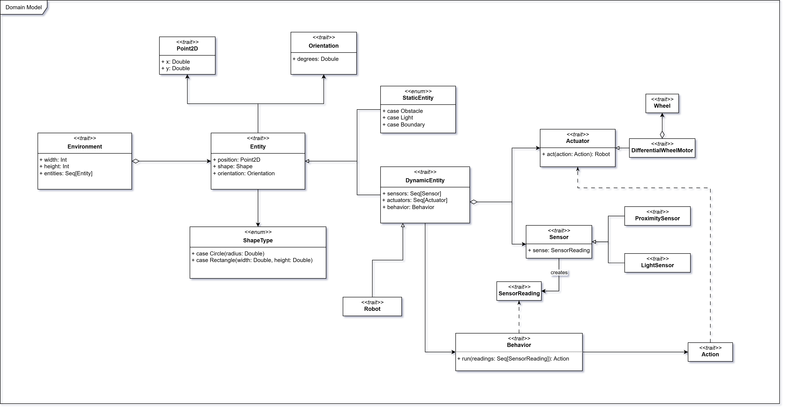

# Modello di dominio

Sotto la guida dell'esperto di dominio, è stato creato un modello di dominio per rappresentare le principali entità e le
loro relazioni all'interno del sistema.

Il diagramma è stato sviluppato all'inizio del progetto e sono state apportate alcune modifiche durante lo svolgimento
per riflettere meglio le esigenze e i requisiti emersi.
Tuttavia, la struttura di base del modello di dominio è rimasta sostanzialmente invariata.

## Descrizione del modello di dominio

I robot sono entità dinamiche autonome che operano in un ambiente bidimensionale. Essi percepiscono l’ambiente tramite
sensori e vi agiscono attraverso attuatori, seguendo un insieme di regole comportamentali che determinano le loro azioni
in funzione delle percezioni, con l’obiettivo di raggiungere scopi specifici.

L’ambiente contiene diverse entità:

- **Robot** (entità dinamiche): hanno una posizione e un orientamento che definiscono la loro localizzazione nello
  spazio;
- **Ostacoli** (entità statiche): elementi rettangolari che i robot devono evitare per prevenire collisioni;
- **Luci** (entità statiche): elementi circolari che emettono luce e possono influenzare il comportamento dei robot, ad
  esempio attirandoli o respingendoli.