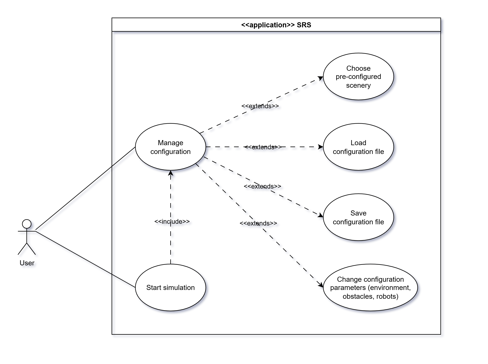
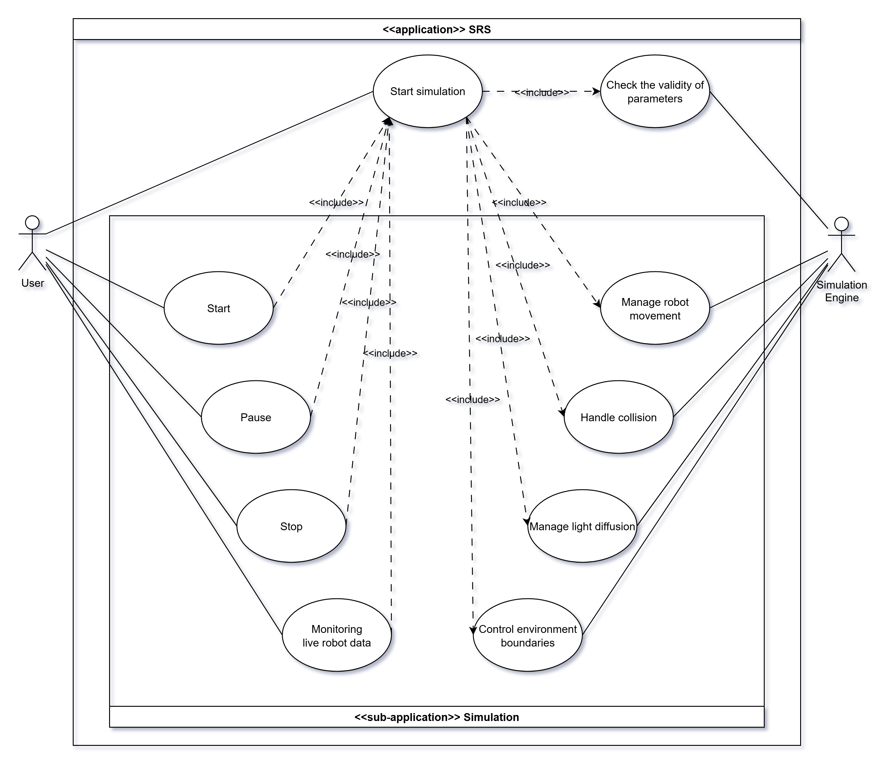

# Funzionali

## Intervista

All'inizio del progetto, il Product Owner e l'Esperto di Dominio hanno condotto un'intervista per raccogliere le
informazioni necessarie a definire i requisiti funzionali utente e di sistema del progetto. L'intervista ha avuto come
obiettivo principale quello di comprendere le aspettative degli utenti e le funzionalità chiave richieste per il sistema
di simulazione robotica.

> Il sistema deve consentire all’utente di gestire e configurare in modo completo i parametri della simulazione,
> riguardanti l’ambiente in cui operano i robot, gli ostacoli presenti e i robot stessi.

> Tra le principali funzionalità richieste c’è la possibilità per l’utente di scegliere uno scenario preconfigurato che
> definisce la disposizione dell’ambiente, degli ostacoli e dei robot. In alternativa, l’utente potrà caricare una
> configurazione precedentemente salvata o salvarne una nuova, così da riutilizzarla o modificarla successivamente.

> Un aspetto cruciale riguarda l’avvio della simulazione: prima di iniziare, il sistema deve verificare la correttezza e
> la validità dei parametri configurati dall’utente. Una volta superata questa fase di validazione, la simulazione può
> partire e l’utente ha la possibilità di controllarne il ciclo di vita attraverso comandi di pausa e arresto. Durante
> l’esecuzione, è inoltre fondamentale garantire la possibilità di monitorare in tempo reale lo stato dei robot, con dati
> aggiornati costantemente per consentire un controllo puntuale delle attività e delle interazioni.

> Il cuore operativo del sistema è rappresentato dal motore di simulazione, che lavora dietro le quinte e si occupa di
> elaborare la logica della simulazione. Questo motore gestisce aspetti fisici e comportamentali fondamentali, quali il
> movimento dei robot, la gestione delle collisioni e la diffusione della luce nell’ambiente simulato.

## Casi d'uso

Sulla base delle informazioni raccolte durante l’intervista, sono stati modellati i seguenti casi d’uso.

|  |
| --------------------------------------------------------------------------------- |
|  |

Di seguito sono riportati i requisiti funzionali, sia utente che di sistema, emersi dall'analisi dell'intervista e dei
casi d'uso.

## Utente

- **[UF-01](../08-user-guide/01-configuration.md)** – Scelta di uno scenario preconfigurato;
- Gestione parametri della simulazione:
  - **[UF-02](https://github.com/Scala-Robotics-Simulator/PPS-22-srs/blob/main/src/test/scala/io/github/srs/model/environment/EnvironmentTest.scala)** - Dimensioni ambiente;
  - **[UF-03](../08-user-guide/01-configuration.md)** - Durata simulazione;
  - **[UF-04](../08-user-guide/01-configuration.md)** - Seed;
  - **[UF-05](https://github.com/Scala-Robotics-Simulator/PPS-22-srs/blob/main/src/test/scala/io/github/srs/model/entity/dynamicentity/actuator/DifferentialWheelMotorTest.scala)** - Velocità massima dei robot;
- Gestione entità:
  - **[UF-06](https://github.com/Scala-Robotics-Simulator/PPS-22-srs/blob/main/src/test/scala/io/github/srs/model/entity/dynamicentity/dsl/RobotDslTest.scala)** – Robot (numero, posizione, dimensione, orientazione, velocità massima);
  - **[UF-07](https://github.com/Scala-Robotics-Simulator/PPS-22-srs/blob/main/src/test/scala/io/github/srs/model/entity/staticentity/dsl/ObstacleDslTest.scala)** – Ostacoli (numero, posizione, dimensione, orientazione);
  - **[UF-08](https://github.com/Scala-Robotics-Simulator/PPS-22-srs/blob/main/src/test/scala/io/github/srs/model/entity/staticentity/dsl/LightDslTest.scala)** – Luci (numero, posizione, intensità).
- Gestione sensori:
  - **[UF-09](https://github.com/Scala-Robotics-Simulator/PPS-22-srs/blob/main/src/test/scala/io/github/srs/model/entity/dynamicentity/dsl/RobotDslTest.scala)** – Presenza o assenza dei sensori di prossimità;
  - **[UF-10](https://github.com/Scala-Robotics-Simulator/PPS-22-srs/blob/main/src/test/scala/io/github/srs/model/entity/dynamicentity/dsl/RobotDslTest.scala)** – Presenza o assenza dei foto sensori.
- Gestione configurazione di simulazione:
  - **[UF-11](https://github.com/Scala-Robotics-Simulator/PPS-22-srs/blob/main/src/test/scala/io/github/srs/config/YamlConfigManagerTest.scala)** – Salvataggio;
  - **[UF-12](https://github.com/Scala-Robotics-Simulator/PPS-22-srs/blob/main/src/test/scala/io/github/srs/config/YamlConfigManagerTest.scala)** – Caricamento di file personalizzati;
- **[UF-13](../08-user-guide/02-simulation.md)** – Avviare, mettere in pausa o fermare la simulazione;
- **[UF-14](../08-user-guide/02-simulation.md)** – Modificare velocità di simulazione per esperimenti lunghi.

## Di sistema

- Generazione entità:
  - **[SF-01](https://github.com/Scala-Robotics-Simulator/PPS-22-srs/blob/main/src/test/scala/io/github/srs/model/entity/dynamicentity/dsl/RobotDslTest.scala)** – Robot circolari con raggio variabile;
  - **[SF-02](https://github.com/Scala-Robotics-Simulator/PPS-22-srs/blob/main/src/test/scala/io/github/srs/model/entity/staticentity/dsl/ObstacleDslTest.scala)** – Ostacoli rettangolari;
  - **[SF-03](../08-user-guide/01-configuration.md)** – Ambiente con dimensione definita dall’utente.
- Gestione fisica:
  - **[SF-04](https://github.com/Scala-Robotics-Simulator/PPS-22-srs/blob/main/src/test/scala/io/github/srs/model/entity/dynamicentity/actuator/DifferentialWheelMotorTest.scala)** – Movimento robot tramite ruote;
  - **[SF-05](https://github.com/Scala-Robotics-Simulator/PPS-22-srs/blob/main/src/test/scala/io/github/srs/model/environment/dsl/CreationDSLTest.scala)** – Rilevamento e gestione collisioni;
  - **[SF-06](https://github.com/Scala-Robotics-Simulator/PPS-22-srs/blob/main/src/test/scala/io/github/srs/model/illumination/LightMapTest.scala)** – Calcolo diffusione della luce;
  - **[SF-07](https://github.com/Scala-Robotics-Simulator/PPS-22-srs/blob/main/src/test/scala/io/github/srs/model/environment/dsl/CreationDSLTest.scala)** – Limiti ambientali.
- Logica di sistema:
  - **[SF-08](./../08-user-guide/03-cli.md)** – Esporre API di controllo da CLI;
  - **[SF-09](https://github.com/Scala-Robotics-Simulator/PPS-22-srs/blob/main/src/test/scala/io/github/srs/model/environment/dsl/CreationDSLTest.scala)** – Invalidazione di entità sovrapposte;
  - **[SF-10](https://github.com/Scala-Robotics-Simulator/PPS-22-srs/blob/main/src/test/scala/io/github/srs/model/dsl/GridDSLTest.scala)** – Ritorno posizioni finali dei robot a fine simulazione.
- **[SF-11](https://github.com/Scala-Robotics-Simulator/PPS-22-srs/blob/main/src/test/scala/io/github/srs/model/dsl/GridDSLTest.scala)** – Eseguire simulazione CLI a massima velocità.
