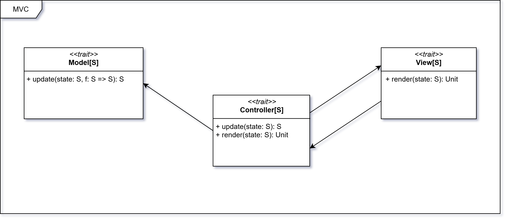

# Design Architetturale

## Architettura del sistema

L'architettura del sistema è basata sul pattern **Model-View-Controller** (MVC). Questo paradigma
consente di separare le responsabilità all'interno dell'applicazione e favorisce una chiara distinzione tra la logica di
business e quella di presentazione.

Tale architettura è ulteriormente modulata tramite l'utilizzo del **Cake Pattern**, una tecnica di *dependency
injection* che permette di definire i componenti Model, View e Controller come moduli indipendenti (tramite *trait*),
specificando in modo esplicito le dipendenze tra di essi. Questo approccio facilita la composizione, la testabilità e la
sostituzione dei singoli componenti.

L’intera architettura è definita in modo generico rispetto al tipo di stato `S`, che rappresenta l’informazione
mantenuta
e gestita durante la simulazione. I trait `Model`, `View` e `Controller` sono parametrizzati rispetto a `S`, garantendo
riusabilità e indipendenza rispetto a una specifica rappresentazione dello stato.

## Componenti dell'architettura

L'architettura è costituita da tre componenti principali:

- ### Model
  Rappresenta la logica di business dell'applicazione. In particolare, gestisce lo stato del simulatore e le
  regole di interazione tra le entità. Lo stato viene esposto in sola lettura; l'unico modo per
  modificarlo è tramite la funzione `update`, che riceve lo stato corrente e una funzione di
  aggiornamento `f: S ⇒ S`, restituendo un nuovo stato aggiornato. Questa scelta consente di mantenere il Model
  immutabile e facilmente testabile, riducendo i possibili effetti collaterali.

- ### View
  È responsabile della visualizzazione dello stato dell'applicazione e dell'interazione con l'utente. Riceve dal
  Controller le informazioni, che a sua volta le ottiene dal Model, e le visualizza in modo appropriato. La View si
  limita a presentare i dati ricevuti e a mostrarne gli aggiornamenti tramite la funzione `render`.
  L'interazione con l'utente viene interpretata dal Controller, che si occupa di inviare gli eventi al Model. In questo
  modo, la View rimane indipendente dalla logica del Model e può essere facilmente sostituita o modificata senza
  impattare il funzionamento del simulatore.

- ### Controller
  È il componente che gestisce la logica di controllo dell'applicazione. Funge da intermediario tra Model e View,
  mantenendo una chiara separazione delle responsabilità. Il Controller espone la funzione `simulationLoop`,
  che rappresenta il ciclo principale della simulazione. All'interno di questo ciclo, il Controller riceve l'attuale
  stato
  dell'applicazione, elabora gli eventi provenienti dalla View, costruisce le funzioni di aggiornamento da applicare al
  Model e richiama la View per visualizzare i risultati tramite `render`.
  Questo approccio consente di centralizzare la logica del flusso di simulazione, separando chiaramente il controllo
  dalla logica di business e dalla presentazione, rendendo l'applicazione più modulare ed estendibile.

### Pattern ↔ uso nel progetto

L’implementazione adotta alcuni pattern funzionali per mantenere il codice modulare, testabile e facile da estendere.

- **Cake Pattern (MVC)**: usato per comporre `Model`, `View`, `Controller` come moduli indipendenti e iniettarne le
  dipendenze in modo
  esplicito. Migliora sostituibilità e testabilità dei componenti.

- **Tagless Final (azioni, configurazione)**: le interfacce sono parametrizzate su `F[_]` (es. `Action[F]`,
  `ConfigManager[F]`), così l’uso dell’effetto è un
  dettaglio sostituibile (`IO`, `SyncIO`, `EitherT`, ecc.) e i test possono usare interpreti fittizi.

- **Reader via Kleisli (behavior)**: le decisioni sono funzioni da un contesto immutabile a un risultato, modellate con
  `Kleisli`.

| Pattern/Concetto   | Dove                         | Perché utile                                     |
|--------------------|------------------------------|--------------------------------------------------|
| Cake Pattern (MVC) | Architettura MVC             | DI esplicita, moduli sostituibili, testabilità   |
| Tagless Final      | Action, ConfigManager        | Effetto astratto, interpreti multipli, test      |
| Kleisli            | Behavior/Policy DSL          | Contesto puro, composizione, refactoring effetti |
| ADT & opaque types | Dominio, ScaleFactor, Errori | Modello sicuro, invarianti a compile-time        |
| cats-effect (IO)   | Controller/View, LightMap    | Effetti e concorrenza gestiti in modo sicuro     |
