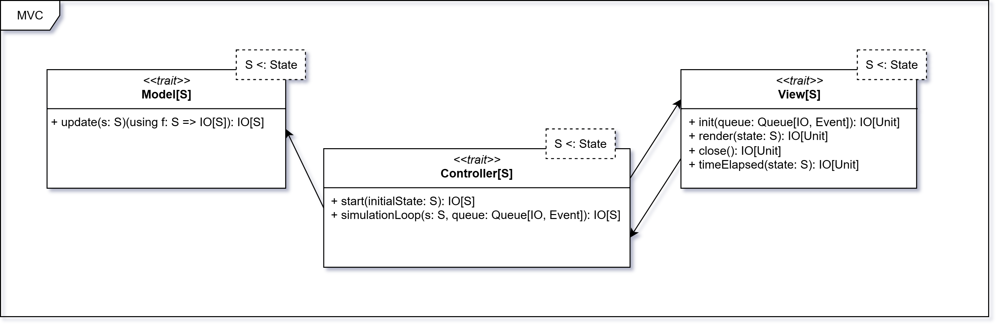

# Design Architetturale

## Architettura del sistema

L'architettura del sistema è basata sul pattern **Model-View-Controller** (MVC). Questo paradigma
consente di separare le responsabilità all'interno dell'applicazione e favorisce una chiara distinzione tra la logica di
business e quella di presentazione.

Tale architettura è ulteriormente modulata tramite l'utilizzo del **Cake Pattern**, una tecnica di *dependency
injection* che permette di definire i componenti Model, View e Controller come moduli indipendenti (tramite *trait*),
specificando in modo esplicito le dipendenze tra di essi. Questo approccio facilita la composizione, la testabilità e la
sostituzione dei singoli componenti.

## Componenti dell'architettura

L'architettura è costituita da tre componenti principali:

- ### Model
  Rappresenta la logica di business dell'applicazione. In particolare, gestisce lo stato del simulatore e le
  regole di interazione tra le entità. Lo stato viene esposto in sola lettura; l'unico modo per
  modificarlo è tramite la funzione `update`, che riceve lo stato corrente e una funzione di
  aggiornamento `f: S ⇒ S`, restituendo un nuovo stato aggiornato. Questa scelta consente di mantenere il Model
  immutabile e facilmente testabile, riducendo i possibili effetti collaterali.

- ### View
  È responsabile della visualizzazione dello stato dell'applicazione e dell'interazione con l'utente. Riceve dal
  Controller le informazioni, che a sua volta le ottiene dal Model, e le visualizza in modo appropriato. La View si
  limita a presentare i dati ricevuti e a mostrarne gli aggiornamenti tramite la funzione `render`.
  L'interazione con l'utente viene interpretata dal Controller, che si occupa di inviare gli eventi al Model. In questo
  modo, la View rimane indipendente dalla logica del Model e può essere facilmente sostituita o modificata senza
  impattare il funzionamento del simulatore.

- ### Controller
  È il componente che gestisce la logica di controllo dell'applicazione. Funge da intermediario tra Model e View,
  mantenendo una chiara separazione delle responsabilità. Si occupa di interpretare i comandi provenienti dalla View,
  tradurli in funzioni di aggiornamento da applicare al Model tramite `update` e infine aggiornare la View chiamando
  `render`. Questo approccio consente di separare la logica di controllo da quella di presentazione e di business,
  rendendo l'applicazione più modulare ed estendibile.
