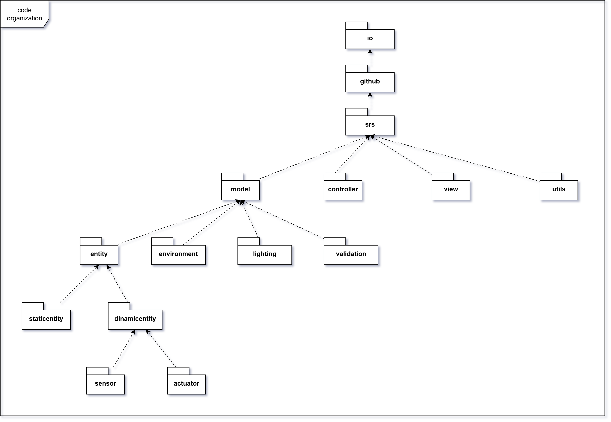

# Organizzazione del Codice

La struttura del codice è organizzata in modo da facilitare la comprensione e la manutenzione del progetto. La seguente
immagine mostra la struttura delle cartelle:

NB: alcune cartelle sono state omesse per semplificare la visualizzazione, ad esempio quelle contenute in `utils` e
tutte le cartelle `dsl`.