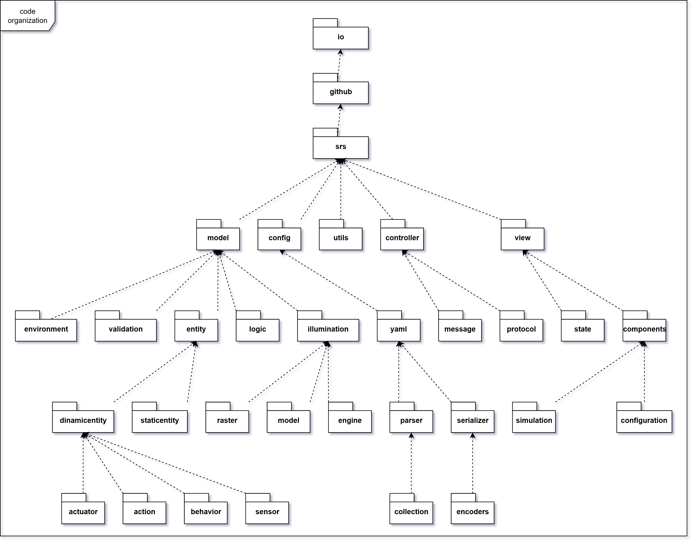

# Organizzazione del Codice

La struttura del codice è organizzata in modo da facilitare la comprensione e la manutenzione del progetto. La seguente
immagine mostra la struttura delle cartelle:

NB: alcune cartelle sono state omesse per semplificare la visualizzazione, ad esempio quelle contenute in `utils` e
tutte le cartelle `dsl`.

## Descrizione delle Cartelle

Il codice è suddiviso in 5 _package_ principali:
- `model`: contiene le classi che rappresentano il modello di dominio del simulatore;
- `view`: contiene le classi che gestiscono l'interfaccia utente e l'interazione con l'utente;
- `controller`: contiene le classi che gestiscono la logica di controllo e l'interazione tra il modello e la vista;
- `utils`: contiene le classi di utilità e le librerie di supporto;
- `config`: contiene le classi che gestiscono la configurazione del simulatore.