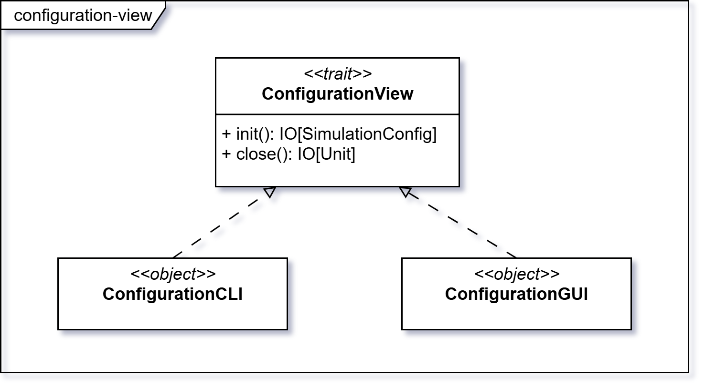

# Entry Point

## Avvio dell’applicazione

L’applicazione si avvia dal punto di ingresso `main`, che interpreta gli argomenti da linea di comando e determina la
modalità di esecuzione:

- **CLI**: modalità testuale senza interfaccia grafica;
- **GUI**: modalità con interfaccia grafica.

In base alla scelta, il `main` inizializza la configurazione della simulazione, costruisce lo stato iniziale e
seleziona il `launcher` appropriato (CLI o GUI) a cui delegare l’avvio del sistema.

Il `launcher` rappresenta il ponte tra il `main` e l’architettura MVC:

- fornisce la vista corrispondente alla modalità selezionata;
- collega `Model`, `View` e `Controller`;
- avvia la simulazione passando al `Controller` lo stato iniziale.

In questo modo, il `main` si limita a scegliere e configurare, mentre il `launcher` si occupa di predisporre i componenti
dell’architettura e avviarne l’esecuzione.

### Gestione degli argomenti

All’avvio, gli argomenti della linea di comando vengono analizzati per determinare i parametri di configurazione della
simulazione.
Questi includono, ad esempio:

- scelta della modalità (CLI o GUI);
- percorso di un file di configurazione;
- durata complessiva della simulazione;
- seed per la riproducibilità;
- informazioni di help o di versione.

:::info

I dettagli di implementazione della modalità CLI e degli argomenti della linea di comando sono descritti nella sezione [Command Line Interface](../05-implementation/04-giulia-nardicchia/cli.md).

:::

## Configuration View

L’interfaccia `ConfigurationView` definisce il comportamento comune delle viste di configurazione:

Chiamando il metodo `init()` si apre l'interfaccia di configurazione e si restituisce la configurazione scelta dall'utente.
Questo processo viene facilitato dall'utilizzo dell'effetto `IO`, in quanto consente di gestire in modo semplice e sicuro le operazioni di input/output, garantendo la corretta esecuzione delle azioni richieste dall'utente.
In questo modo il chiamante della funzione può essere certo che il risultato dell'`IO` sarà una configurazione valida del simulatore, con la quale potrà andare ad avviare la simulazione.

Il metodo `close` è separato da `init` per lasciare libertà all'utilizzatore di gestire la chiusura dell'interfaccia utente in modo indipendente dall'inizializzazione, e non obbligatoriamente quando la configurazione è stata scelta.

:::info

Per i dettagli di implementazione della modalità CLI e GUI, si rimanda alle sezioni [ConfigurationCLI](../05-implementation/04-giulia-nardicchia/cli.md#configurationcli) e [ConfigurationGUI](../05-implementation/02-simone-ceredi/5-config-gui.md).

:::