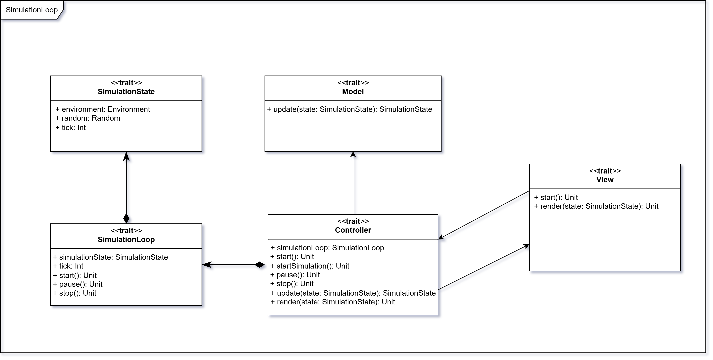

# MVC e Simulation Core

## ControllerModule

Il `ControllerModule` è strutturato secondo il `Cake Pattern`, integrandosi con:

- il `ModelModule`, che gestisce l'aggiornamento dello stato della simulazione;
- il `ViewModule`, che si occupa della visualizzazione e dell’interazione con l’utente.

Il trait `Controller[S]` è parametrizzata sul tipo di stato `S`, che deve estendere `ModelModule.State`.
Esso espone due metodi:

- `start(initialState: S): IO[S]`: avvia la simulazione;
- `simulationLoop(s: S, queue: Queue[IO, Event]): IO[S]`: esegue il ciclo principale della simulazione.

Il `Controller` è responsabile dell’avvio della simulazione, della gestione del ciclo di esecuzione, del trattamento
degli eventi e della comunicazione tra il `Model` e la `View`.
L’implementazione segue un approccio modulare e funzionale, sfruttando `Cats Effect` per la gestione della concorrenza
ed effetti asincroni.

Il trait `Provider[S]` espone un’istanza concreta di `Controller[S]` e permette l’iniezione del controller nei moduli
che ne hanno bisogno.

Il trait `Component[S]` fornisce l’implementazione concreta del `Controller` e richiede i moduli `ModelModule.Provider`
e `ViewModule.Provider`.
Contiene l’oggetto `Controller`, che fornisce un’implementazione concreta dell'interfaccia Controller.

Il trait `Interface[S]` combina `Provider` e `Component`, fungendo da interfaccia unificata del modulo.

## Implementazione del Controller

### Avvio della simulazione

Il metodo `start` inizializza la simulazione creando una coda di eventi e avviando il ciclo di simulazione:

- utilizza `Queue.unbounded[IO, Event]` per creare una coda di eventi asincrona e non bloccante;
- avvia la view chiamando `context.view.init`, che prepara l’interfaccia utente;
- esegue i comportamenti dei robot con `runBehavior`, che raccoglie in parallelo le proposte di azione dei robot;
- infine, avvia il ciclo principale chiamando `simulationLoop` passando lo stato iniziale e la coda degli eventi.

### Ciclo di simulazione

Il metodo `simulationLoop` implementa una funzione ricorsiva che:

- esegue i comportamenti dei robot se lo stato è `RUNNING`
- recupera ed elabora gli eventi dalla coda (`handleEvents`)
- aggiorna la vista con lo stato corrente (`context.view.render`)
- verifica la condizione di stop:
    - stato `STOPPED`
    - tempo massimo di simulazione raggiunto
- se la simulazione non è terminata:
    - esegue `nextStep` in base allo stato (`RUNNING`, `PAUSED`, `STOPPED`)
    - ripete ricorsivamente il loop.

### Gestione degli eventi

Il metodo `handleEvents` recupera tutti gli eventi dalla coda e li elabora in sequenza.

Gli eventi (`Event`) comprendono:

- `Tick`: avanzamento temporale della simulazione;
- `TickSpeed`: modifica della velocità dei tick;
- `Random`: aggiornamento del generatore casuale;
- `Pause` / `Resume` / `Stop`: controllo dello stato della simulazione (pausa, ripresa, stop);
- `RobotActionProposals`: gestione delle proposte di azione (`RobotProposal`) dei robot a ogni tick.

Ogni evento nel `Controller` viene trasformato in un aggiornamento dello stato tramite le logiche definite nel
`LogicsBundle`.
Il `LogicsBundle` viene passato implicitamente al controller come `given` e utilizzato con la keyword `using` quando il
`Controller` chiama il metodo `update` del model.

In questo modo:

- il `Controller` non modifica direttamente lo stato;
- ma delega tutte le trasformazioni al `Model`, specificando quale logica applicare (`tick`, `pause`, `stop`, `resume`,
  ecc.);
- il `Model` applica la logica appropriata e restituisce il nuovo stato aggiornato.

Questo consente al `Controller` di continuare il ciclo della simulazione con lo stato corretto, senza occuparsi
direttamente delle regole di aggiornamento o dei dettagli della business logic.

### Esecuzione dei comportamenti dei robot

Il metodo `runBehavior` seleziona tutte le entità di tipo `Robot` presenti nell’ambiente.

Per ogni robot:

- legge i sensori (`senseAll`);
- costruisce un `BehaviorContext` e calcola l’azione da compiere tramite la logica del robot (`robot.behavior.run`);
- aggiorna il generatore casuale della simulazione (`Event.Random`);
- crea una proposta di azione (`RobotProposal`);
- al termine, inserisce in coda un evento `RobotActionProposals` contenente tutte le proposte di azione raccolte.