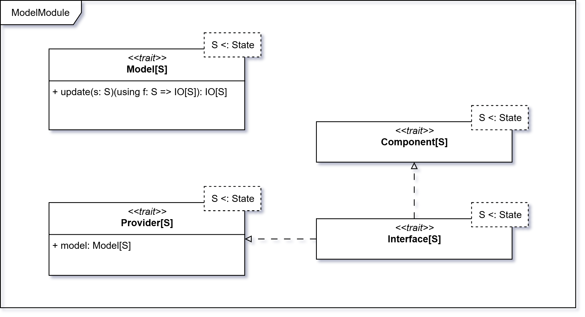
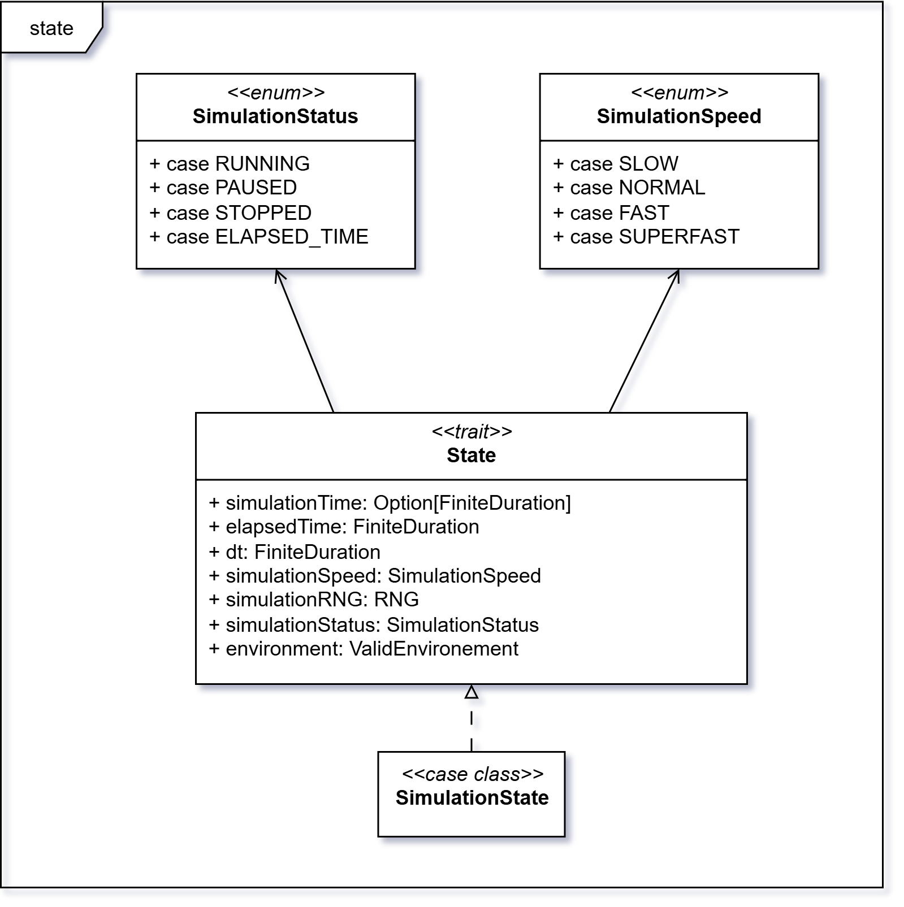
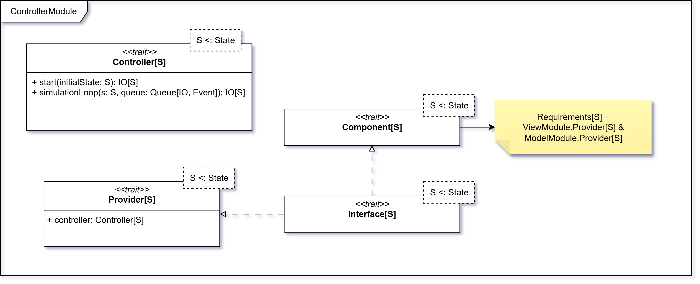
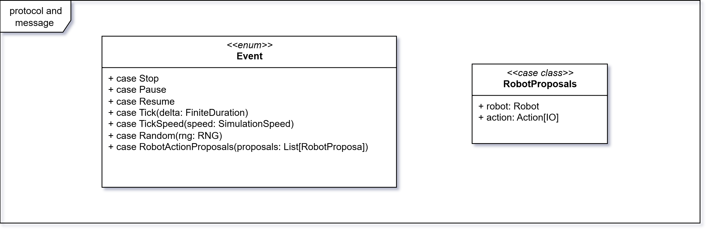
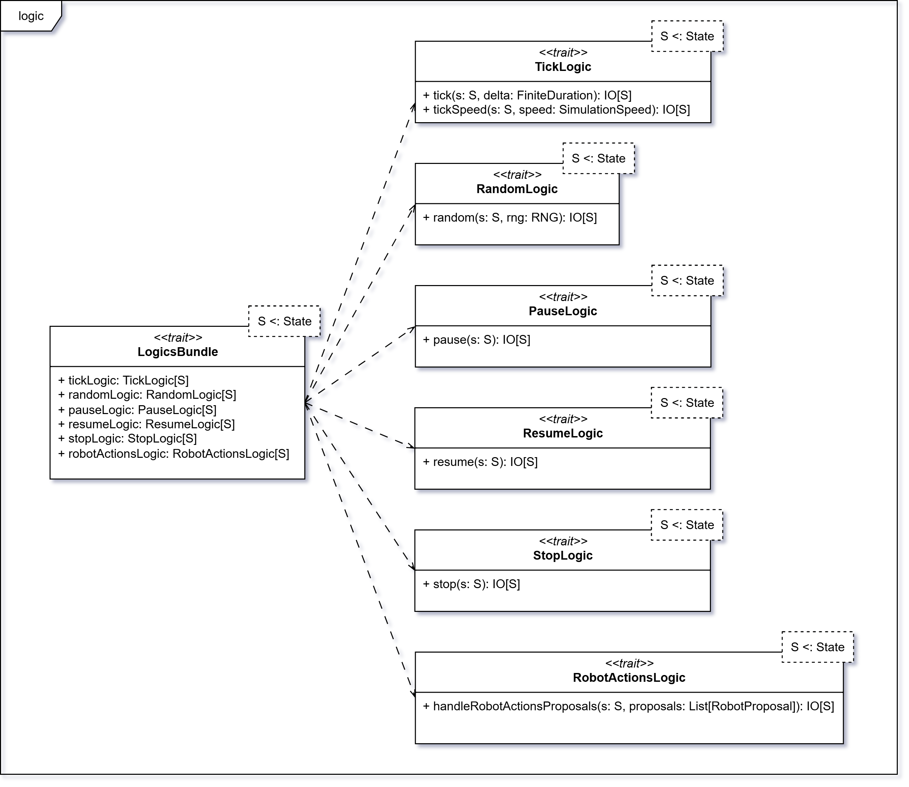
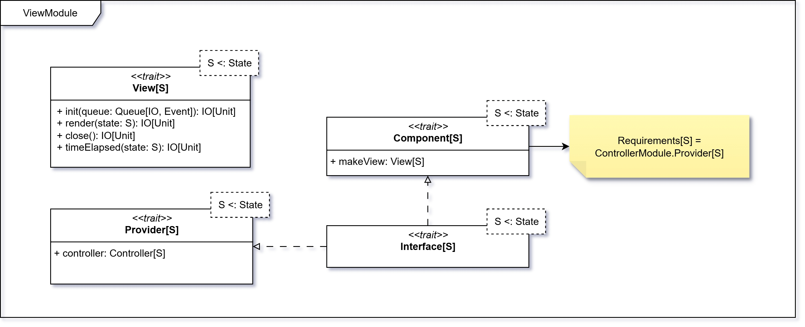

# MVC e Simulation Core

In questa sezione viene presentato il design di dettaglio del `Model`, `View` e `Controller` della simulazione.

## Model

Il `Model` è responsabile della gestione dello stato della simulazione in maniera funzionale e sicura.
Si occupa di applicare le logiche di aggiornamento dello stato in risposta agli eventi generati dal `Controller`.

### Definizione dello stato

Il _trait_ `State` definisce la struttura dello stato della simulazione, che comprende i seguenti campi:

- `simulationTime`: durata totale prevista (opzionale, per supportare simulazioni infinite);
- `elapsedTime`: tempo trascorso dall’inizio della simulazione;
- `dt`: delta time della simulazione (intervallo temporale di ciascuno step);
- `simulationSpeed`: velocità corrente della simulazione;
- `simulationRNG`: generatore di numeri casuali (`RNG`) usato per introdurre elementi stocastici nei comportamenti dei
  robot;
- `simulationStatus`: stato corrente della simulazione;
- `environment`: rappresenta l’ambiente della simulazione, contenente le entità validate (di tipo `ValidEnvironment`).

:::info note
Vedere la sezione [Generatore di numeri casuali](../05-implementation/04-giulia-nardicchia/random-number-generator.md), [Environment](./04-environment.md) per
maggiori dettagli.
:::

#### SimulationSpeed

`SimulationSpeed` è una _enum_ che definisce le possibili velocità della simulazione:
- `SLOW`: velocità ridotta (200 ms per tick);
- `NORMAL`: velocità standard (100 ms per tick);
- `FAST`: velocità aumentata (10 ms per tick);
- `SUPERFAST`: velocità massima (0 ms per tick, usata in esecuzione `headless` per massimizzare la velocità).

#### SimulationStatus

`SimulationStatus` è una _enum_ che rappresenta i possibili stati della simulazione:

- `RUNNING`: simulazione in esecuzione;
- `PAUSED`: simulazione in pausa;
- `STOPPED`: simulazione fermata manualmente;
- `ELAPSED_TIME`: raggiunto il tempo massimo previsto della simulazione.

### Logica di aggiornamento dello stato

L’interfaccia del `Model` espone il metodo `update`, che accetta lo stato corrente e una funzione di aggiornamento.
Questa funzione viene applicata per produrre un nuovo stato, garantendo così l’immuabilità e la consistenza della
simulazione.

:::info
Per i dettagli di implementazione riguardante il **Model**, si rimanda alla
sezione [ModelModule](../05-implementation/04-giulia-nardicchia/mvc-implementation.md#modelmodule).
:::

## Controller

Il `Controller` ha il compito di orchestrare la simulazione, coordinando l’interazione tra `Model` e `View`.
Le sue responsabilità principali sono:

- avviare la simulazione partendo da uno stato iniziale;
- gestire il ciclo di esecuzione della simulazione;
- elaborare gli eventi prodotti dal sistema o dai robot;
- aggiornare la `View` in base allo stato corrente;
- richiedere al `Model` l’applicazione delle logiche di aggiornamento appropriate.

Il comportamento del `Controller` può essere schematizzato in tre macro-attività:

- avvio della simulazione;
- ciclo di simulazione;
- gestione degli eventi.

### Avvio della simulazione

- inizializza le strutture necessarie alla gestione degli eventi;
- prepara la `View` per la rappresentazione grafica;
- attiva i comportamenti dei robot per generare azioni iniziali.

### Ciclo di simulazione

- gestisce gli eventi ricevuti;
- aggiorna lo stato tramite il `Model`;
- aggiorna la `View` per riflettere lo stato corrente;
- controlla le condizioni di terminazione (stop manuale o tempo massimo raggiunto);
- prosegue fino alla fine della simulazione.

### Gestione degli eventi

- traduce gli eventi in funzioni di aggiornamento dello stato;
- delega al `Model` l’applicazione delle logiche di trasformazione (avanzamento del tempo, pausa, stop, azioni dei
  robot, ecc.).

Di seguito è illustrato il diagramma dei possibili eventi gestiti dal `Controller` e un tipo di messaggio usato per
utilità:

### LogicsBundle

Per mantenere separata la business logic dal `Controller`, le logiche di aggiornamento sono raccolte in un
`LogicsBundle`, che contiene funzioni come:

- avanzamento del tempo;
- gestione della velocità;
- pausa/ripresa/stop della simulazione;
- aggiornamento del generatore casuale;
- applicazione delle azioni proposte dai robot.

Il `Controller` utilizza queste logiche per aggiornare lo stato in risposta agli eventi, delegando l’effettiva
trasformazione al `Model`.

Di seguito è riportato il diagramma del `LogicsBundle`:

:::info
Per i dettagli di implementazione del **Controller**, si rimanda alla
sezione [ControllerModule](../05-implementation/04-giulia-nardicchia/mvc-implementation.md#controllermodule).
:::

## View

La `View` ha il compito di gestire la rappresentazione della simulazione e l’interazione con l’utente.
Le responsabilità principali della `View` si possono sintetizzare in tre fasi:
- inizializzazione
  - prepara l’interfaccia (grafica o testuale);
  - collega la coda degli eventi, in modo da permettere all’utente o al sistema di inviare comandi alla simulazione;
- aggiornamento
  - riceve lo stato corrente dal `Controller`;
  - visualizza l’ambiente e le entità aggiornate, riflettendo l’evoluzione della simulazione in tempo reale;
- terminazione
  - chiude l’interfaccia alla fine della simulazione (nel caso della modalità grafica);
  - esegue azioni dedicate quando viene raggiunto il tempo massimo (ad esempio, mostrando l'ambiente dello stato finale).

In questo modo la `View` resta un modulo indipendente e intercambiabile: è possibile fornire diverse implementazioni (ad
esempio CLI o GUI) senza alterare le logiche di simulazione.

:::info
Per ulteriori dettagli sull’implementazione della:
- **View**, si rimanda alla
  sezione [ViewModule](../05-implementation/04-giulia-nardicchia/mvc-implementation.md#viewmodule);
- modalità **CLI**, si veda la sezione [CLIComponent](../05-implementation/04-giulia-nardicchia/cli.md#clicomponent).
:::