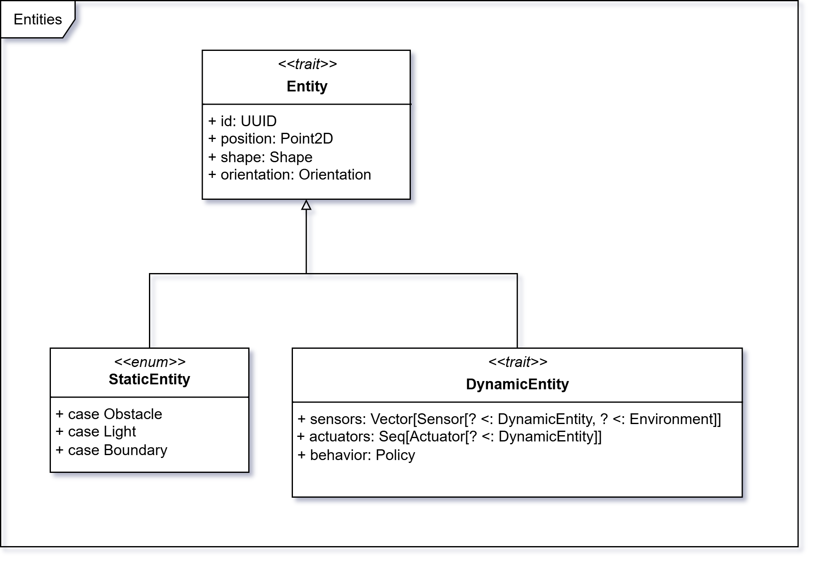
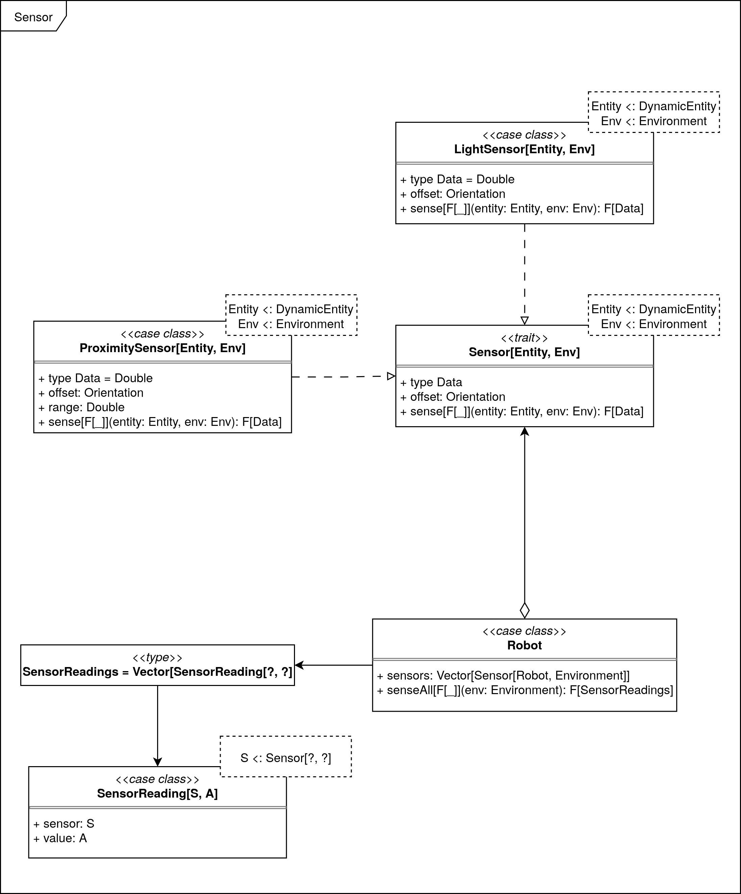

# Entity

In questa sezione, viene descritta la struttura e le funzionalità delle entità nel sistema di simulazione.

## Entità

Il *trait* `Entity` descrive un’entità spaziale dotata di una posizione bidimensionale (`position: Point2D`), una forma
geometrica (`shape: ShapeType`), rappresentata dal tipo enumerato `ShapeType`, e un orientamento (
`orientation: Orientation`) espresso in gradi.  
Questo trait costituisce l’interfaccia di base per ogni oggetto collocato nello spazio simulato, fornendo una struttura
comune per modellare oggetti dinamici o statici.

### Posizione

La classe `Point2D` rappresenta un punto nel piano cartesiano bidimensionale. Oltre ai campi `x: Double` e `y: Double`,
essa fornisce un insieme di operazioni geometriche fondamentali:

- Somma e sottrazione vettoriale
- Moltiplicazione per scalare
- Prodotto scalare
- Modulo del vettore
- Normalizzazione del vettore
- Calcolo della distanza tra punti

Questa classe costituisce la base per il calcolo di spostamenti, direzioni e interazioni spaziali tra entità.

### Forma

La forma geometrica delle entità è definita dal tipo *enum* `ShapeType`, che può assumere due varianti:

- `Circle(radius: Double)`: rappresenta un cerchio con raggio specificato.
- `Rectangle(width: Double, height: Double)`: rappresenta un rettangolo con larghezza e altezza definite.

Questo approccio consente una modellazione semplice ma estensibile delle dimensioni fisiche degli oggetti nello spazio
simulato.

### Orientamento

Il *trait* `Orientation` descrive l’angolo di rotazione di un’entità rispetto a un sistema di riferimento fisso.
Contiene:

- `degrees: Double`: l’orientamento espresso in gradi.
- `toRadians: Double`: la conversione in radianti, utile per calcoli trigonometrici e trasformazioni geometriche.

L’orientamento permette di rappresentare la direzione verso cui è rivolto un oggetto nello spazio, supportando il
movimento direzionale e la rotazione.

## Entità statiche e dinamiche

`DynamicEntity` e `StaticEntity` sono due *trait* che estendono `Entity`.

### DynamicEntity

Il *trait* `DynamicEntity` rappresenta un'entità in grado di muoversi e interagire con l’ambiente circostante.
Comprende:

- `sensors: SensorSuite`: un insieme di sensori che percepiscono l’ambiente
- `actuators: Seq[Actuator[? <: DynamicEntity]]`: una sequenza di attuatori che modificano lo stato dell’entità o
  dell’ambiente.

Questa struttura è pensata per simulare comportamenti robotici, in cui percezione e azione sono fortemente integrati.

<!-- TODO: behavior -->

### StaticEntity

Il *trait* `StaticEntity` rappresenta un’entità fissa nello spazio, che non può muoversi né agire attivamente
sull’ambiente, come:

- `Obstacle`: ostacoli fissi che impediscono il movimento di entità dinamiche
- `Light`: fonti di luce che influenzano l’ambiente ma non interagiscono attivamente.

Queste entità possono essere percepite dai sensori delle entità dinamiche, influenzando indirettamente il loro
comportamento.

## Ostacoli

<!-- TODO: ostacoli -->

## Luce

<!-- TODO: luce -->

## Robot

Il *trait* `Robot` estende `DynamicEntity` e rappresenta un'entità mobile autonoma nello spazio bidimensionale, in grado
di interagire con l’ambiente circostante tramite sensori e attuatori. Ogni robot ha una forma circolare
(`ShapeType.Circle`) e possiede un insieme di attuatori (`Seq[Actuator[Robot]]`) e una *suite* di sensori (
`SensorSuite`).

Il *companion object* fornisce un metodo `apply` per la creazione sicura di istanze tramite un sistema di validazione (
`Validation`), assicurandosi che i parametri forniti siano coerenti e privi di valori non validi (ad esempio NaN o
infiniti).

## Attuatori

Un Actuator è un componente in grado di modificare lo stato di un'entità dinamica (`DynamicEntity`). Il *trait*
`Actuator[E]`
definisce un’interfaccia generica per tutti gli attuatori, attraverso il metodo `act(entity: E): Validation[E]`, che
applica un cambiamento all'entità specificata, restituendo una nuova istanza validata.

### Attuatori di movimento

Gli attuatori di movimento `WheelMotor` sono un tipo specifico di attuatori progettati per modificare la posizione e
l'orientamento
di un'entità dinamica nello spazio simulato. Questi attuatori sono implementati come sottotipi di `Actuator[Robot]`,
consentendo loro di agire specificamente su istanze del trait `Robot`.

Un `WheelMotor` è costituito da due ruote (`Wheel`) – sinistra e destra – ognuna dotata
di una velocità lineare (`speed`) e una forma circolare (`ShapeType.Circle`).

L'implementazione `DifferentialWheelMotor` utilizza un modello fisico di tipo differenziale, in cui il movimento viene
calcolato in base alla velocità delle due ruote e alla distanza tra esse (assunta pari al diametro del robot). In
particolare:

- la velocità lineare del robot è la media delle velocità delle due ruote
- la velocità angolare è proporzionale alla differenza di velocità tra le ruote
- la nuova posizione e orientazione vengono calcolate utilizzando le equazioni cinematiche del moto in un piano.

Questa logica è incapsulata nel metodo `act(robot: Robot): Validation[Robot]`, che restituisce una nuova istanza del
robot
con posizione e orientamento aggiornati.

### Azioni

L’enumerazione `Action` definisce un insieme predefinito di comandi che il robot può eseguire, come:

- `MoveForward`: muove il robot in avanti
- `MoveBackward`: muove il robot all'indietro
- `TurnLeft`: ruota il robot verso sinistra
- `TurnRight`: ruota il robot verso destra
- `Stop`: arresta il movimento del robot.

Ogni `Action` è caratterizzata da una coppia di velocità da applicare rispettivamente alla ruota sinistra e destra.
Un’estensione dell’enumerazione consente di applicare direttamente un’azione al robot (`applyTo(robot: Robot): Robot`),
modificando la configurazione dei `WheelMotor` e aggiornando così lo stato del robot.

L’estensione `move` disponibile su `Robot` permette poi di calcolare l'effetto dell’attuatore aggiornato, producendo il
movimento vero e proprio del robot nello spazio simulato.

## Sensori

Il trait `DynamicEntity` include un campo `sensors: SensorSuite`, che rappresenta un insieme di sensori associati all'entità.
`SensorSuite` è un trait che definisce un insieme di sensori, per facilità di utilizzo, ogni tipologia di sensore è specificata all'interno di un campo dedicato.
Il trait `SensorSuite` contiene un metodo `sense(entity)(environment): SensorReadings`, che permette di ottenere una lettura dei sensori per l'entità specificata nell'ambiente di simulazione.
`SensorReading` contiene il riferimento al sensore che ha effettuato la lettura, oltre al valore della lettura stessa.
I `Sensor` sono definiti come un trait che implementa il metodo `sense(entity)(environment): SensorReading`, permettendo di ottenere letture specifiche per ogni tipo di sensore, entity ed environment sono generici e sottotipi rispettivamente dei trait `DynamicEntity` e `Environment`.

### Sensore di Prossimità

Il sensore di prossimità è un tipo di sensore che rileva la presenza di altre entità vicine. Si tratta del trait `ProximitySensor`, che estende il trait `Sensor`.
Il metodo `sense(entity)(environment): Double` restituisce la distanza tra il sensore e l'entità più vicina nell'ambiente di simulazione. Questa distanza viene calcolata tramite `rayCasting`, che verifica se, entro il `range` del sensore, è presente un'altra entità. Il valore restituito è normalizzato tra 0 e 1, dove 0 indica che l'entità è molto vicina e 1 indica che non ci sono entità nel raggio di azione del sensore.
