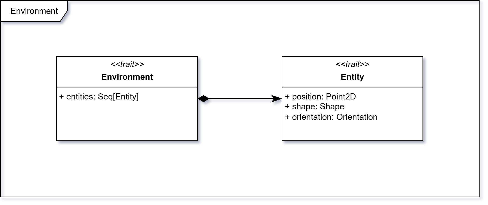

# Environment

La case class `Environment`, estende dal trait `EnvironmentParameters` e rappresenta l'ambiente di simulazione in cui le entità interagiscono. Esso contiene un campo `entities: Set[Entity]`, che rappresenta l'insieme delle entità presenti nell'ambiente.
L'ambiente ha una larghezza (`width: Int`) e un'altezza (`height: Int`), che definiscono le dimensioni dello spazio in cui le entità possono muoversi.
Ai bordi dell'ambiente si trovano dei `Boundary`, si tratta di entità statiche che impediscono alle entità dinamiche di uscire dallo spazio di simulazione.
`LightField` è utilizzato per ottenere l'illuminazione dell'ambiente.



## DSL

Per la creazione dell'ambiente è possibile utilizzare un Domain Specific Language (DSL) che semplifica la definizione delle proprietà dell'ambiente e delle entità in esso contenute.

```scala
infix def withWidth(width: Int): Environment

infix def withHeight(height: Int): Environment

def withHighPrecisionLighting: Environment

def withFastLighting: Environment

def withDefaultLighting: Environment

infix def containing(entities: Set[Entity]): Environment

infix def containing(entity: Entity): Environment

infix def and(entity: Entity): Environment

infix def validate: Validation[ValidEnvironment]
```

In questo modo è possibile creare un ambiente tramite:

```scala
environment withWidth 10 withHeight 10 containing robot and obstacle and light
```

### Validazione

Il DSL per la creazione dell'ambiente include anche un metodo `validate` che restituisce un oggetto di tipo `Validation[ValidEnvironment]`.

<!-- TODO: aggiungere collegamento a validation -->

`ValidEnvironment` è definito come:

```scala
opaque type ValidEnvironment <: EnvironmentParameters = Environment
```

E può essere creato solamente tramite il metodo `validate`. Questo permette di garantire che l'ambiente sia valido e conforme ai requisiti definiti.

I controlli effettuati durante la validazione vanno a:

- controllare che `width` e `height` siano in un intervallo valido;
- controllare che le entità siano posizionate all'interno dei limiti definiti da `width` e `height`;
- verificare che le entità non si sovrappongano tra loro;
- verificare che non vi siano una quantità eccessiva di entità;
- verificare che tutti i robot presenti siano validi.
