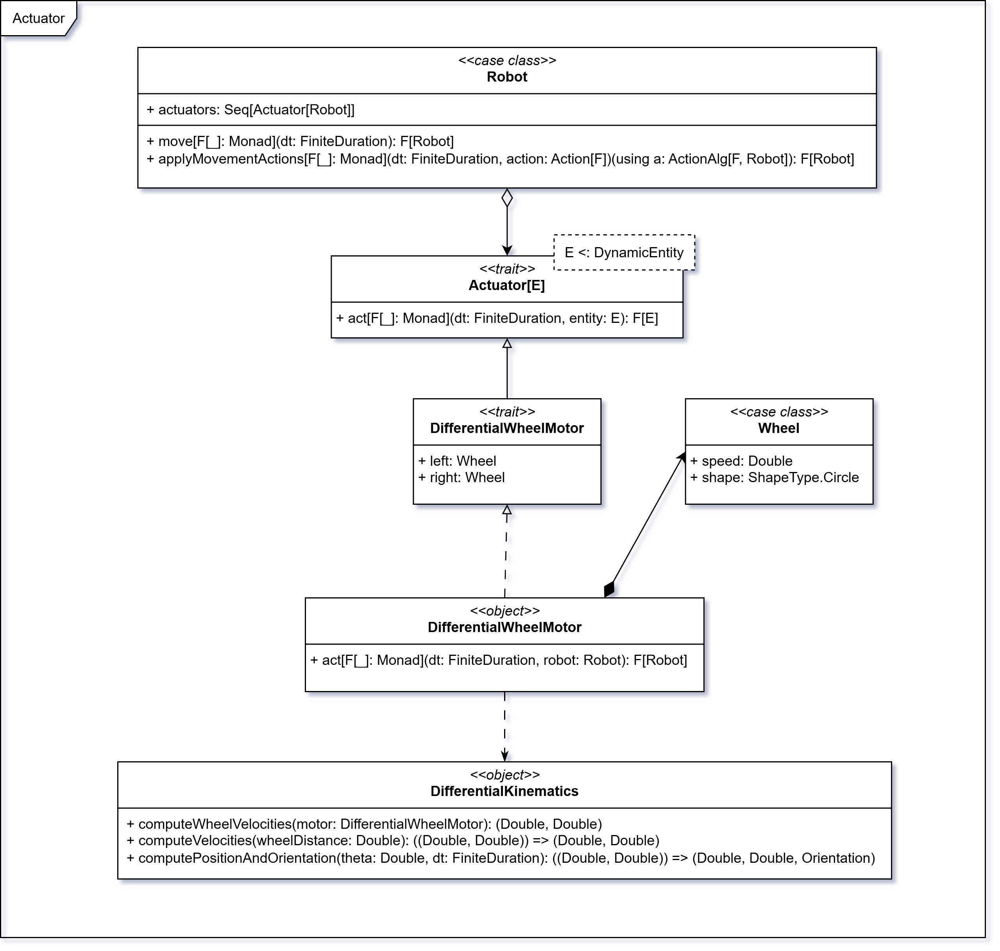

# Entity

In questa sezione, viene descritta la struttura e le funzionalità delle entità nel sistema di simulazione.

## Entità

Il _trait_ `Entity` descrive un’entità spaziale dotata di una posizione bidimensionale (`position: Point2D`), una forma
geometrica (`shape: ShapeType`), rappresentata dal tipo enumerato `ShapeType`, e un orientamento (
`orientation: Orientation`) espresso in gradi.  
Questo trait costituisce l’interfaccia di base per ogni oggetto collocato nello spazio simulato, fornendo una struttura
comune per modellare oggetti dinamici o statici.

### Posizione

La classe `Point2D` rappresenta un punto nel piano cartesiano bidimensionale. Oltre ai campi `x: Double` e `y: Double`,
essa fornisce un insieme di operazioni geometriche fondamentali:

- Somma e sottrazione vettoriale
- Moltiplicazione per scalare
- Prodotto scalare
- Modulo del vettore
- Normalizzazione del vettore
- Calcolo della distanza tra punti

Questa classe costituisce la base per il calcolo di spostamenti, direzioni e interazioni spaziali tra entità.

### Forma

La forma geometrica delle entità è definita dal tipo _enum_ `ShapeType`, che può assumere due varianti:

- `Circle(radius: Double)`: rappresenta un cerchio con raggio specificato.
- `Rectangle(width: Double, height: Double)`: rappresenta un rettangolo con larghezza e altezza definite.

Questo approccio consente una modellazione semplice ma estensibile delle dimensioni fisiche degli oggetti nello spazio
simulato.

### Orientamento

Il _trait_ `Orientation` descrive l’angolo di rotazione di un’entità rispetto a un sistema di riferimento fisso.
Contiene:

- `degrees: Double`: l’orientamento espresso in gradi.
- `toRadians: Double`: la conversione in radianti, utile per calcoli trigonometrici e trasformazioni geometriche.

L’orientamento permette di rappresentare la direzione verso cui è rivolto un oggetto nello spazio, supportando il
movimento direzionale e la rotazione.

## Entità statiche e dinamiche

`DynamicEntity` e `StaticEntity` sono due _trait_ che estendono `Entity`.

### DynamicEntity

Il _trait_ `DynamicEntity` rappresenta un'entità in grado di muoversi e interagire con l’ambiente circostante.
Comprende:

- `sensors: SensorSuite`: un insieme di sensori che percepiscono l’ambiente
- `actuators: Seq[Actuator[? <: DynamicEntity]]`: una sequenza di attuatori che modificano lo stato dell’entità o
  dell’ambiente.

Questa struttura è pensata per simulare comportamenti robotici, in cui percezione e azione sono fortemente integrati.

<!-- TODO: behavior -->

### StaticEntity

Il _trait_ `StaticEntity` rappresenta un’entità fissa nello spazio, che non può muoversi né agire attivamente
sull’ambiente, come:

- `Obstacle`: ostacoli fissi che impediscono il movimento di entità dinamiche
- `Light`: fonti di luce che influenzano l’ambiente ma non interagiscono attivamente.

Ogni `StaticEntity` ha una forma geometrica (`shape: ShapeType`) e una posizione (`position: Point2D`) e
un orientamento (`orientation: Orientation`) coerente:

- `Obstacle`/`Boundary` sono rappresentati da un rettangolo, che può essere orientato;
- `Light` è rappresentato da un cerchio, che non ha orientamento.

> i `boundary` vengono creati da `CreationDSL.validate(insertBoundaries = true)`. Sono rettangoli sottili posizionati
> sui bordi e partecipano a collisioni/resistenza come gli ostacoli.

## Ostacoli

Gli **ostacoli** (`StaticEntity.Obstacle`) sono i “muri” dell’ambiente di simulazione:
blocchi **rettangolari** che occupano spazio, fermano i robot e interrompono il passaggio della luce. Servono a
costruire scenari realistici — dal corridoio stretto al piccolo labirinto — in cui i robot devono pianificare il
movimento ed evitare collisioni.

Ogni ostacolo ha:

- una **posizione** (`position`) e un’**orientazione** (`orientation`) nello spazio;
- due **dimensioni** (`width`, `height`);
- una **forma** coerente, esposta come `ShapeType.Rectangle(width, height)`.

In fase di **validazione** verifichiamo che le dimensioni siano **> 0**, che l’ostacolo stia **dentro i limiti**
dell’ambiente e che **non si sovrapponga** ad altre entità.

## Luce

Le **luci** (`StaticEntity.Light`) sono sorgenti **radiali**: da un punto emettono illuminazione che **decresce con la
distanza** e viene **bloccata** dagli ostacoli e robot. Sono l’ingrediente che rende
l’ambiente leggibile per futuri foto-sensori e utile per esperimenti di percezione.

Ogni luce definisce:

- un **raggio fisico** (`radius`) usato per la sua forma (`ShapeType.Circle(radius)`);
- un **raggio di illuminazione** (`illuminationRadius`) che ne delimita la portata;
- **intensità** (`intensity`) e **attenuazione** (`attenuation`) per controllare quanto e come “decade” la luce;
- un’**orientazione** presente per uniformità del modello, ma l’emissione è **isotropica** (non direzionale).

In fase di **validazione** verifichiamo che raggio, intensità e attenuazione siano **> 0** e che la luce sia
posizionata **all'interno** dell'ambiente.

## Boundary

## Robot

Il _case class_ `Robot` estende `DynamicEntity` e rappresenta un’entità autonoma in grado di muoversi e interagire con
l’ambiente circostante nello spazio bidimensionale. Ogni robot è caratterizzato da un identificativo univoco (`UUID`), 
una posizione e un’orientazione nello spazio, nonché da una forma geometrica circolare (`ShapeType.Circle`).

Il robot è dotato di un insieme di attuatori (`Seq[Actuator[Robot]]`) e di una collezione di sensori 
(`Vector[Sensor[Robot, Environment]]`), che gli permettono di percepire e raccogliere informazioni sull’ambiente. 
Inoltre, possiede una strategia comportamentale (`Policy`) che definisce la logica decisionale del 
robot in base ai dati forniti dai sensori.

Nel _companion object_ `Robot` viene inoltre fornita l’implementazione del _given_ `ActionAlg[IO, Robot]`, ovvero 
l’interprete dell’algebra delle azioni in un contesto di effetto `IO`.

In particolare, l’implementazione del metodo `moveWheels` aggiorna lo stato degli attuatori di tipo 
`DifferentialWheelMotor`, applicando nuove velocità alle ruote sinistra e destra, e restituendo un nuovo stato del 
robot incapsulato in `IO`.

Grazie a questa architettura e all’uso del pattern **Tagless Final** (introdotto nella modellazione delle azioni),
il robot può eseguire azioni in modo astratto e indipendente dal contesto, garantendo modularità ed estensibilità.

:::info note
Vedere la sezione [Action](./07-action.md) per i dettagli sull’algebra delle azioni e il pattern **Tagless Final**.
:::

## Attuatori

Un attuatore è un componente in grado di modificare lo stato di un’entità dinamica (`DynamicEntity`). Il _trait_ `Actuator[E]`
definisce l’interfaccia generica, tramite il metodo `act(dt, entity)`, che aggiorna l’entità dopo un intervallo temporale
`dt`, restituendone una nuova istanza in un contesto monadico `F[_]`.

### Attuatori di movimento

Gli attuatori di movimento sono modellati tramite i motori differenziali (`DifferentialWheelMotor`), costituiti da due
ruote (`Wheel`) – sinistra e destra – dotate di velocità lineare (`speed`) e una forma circolare (`ShapeType.Circle`).
Il movimento del robot viene calcolato con un modello cinematico differenziale (`DifferentialKinematics`), in cui:

- **Velocità lineare** (media delle velocità delle due ruote; ottenute moltiplicando la velocità (`speed`) per il raggio della ruota (`radius`)):

$$
v = \frac{v_{\text{left}} + v_{\text{right}}}{2}
$$

- **Velocità angolare** (proporzionale alla differenza tra le velocità delle ruote divisa per la distanza tra le ruote; si assume che la distanza tra le ruote sia pari al diametro del robot):

$$
\omega = \frac{v_{\text{right}} - v_{\text{left}}}{d_{\text{wheel}}}
$$

- **Nuova posizione e orientazione del robot** integrando le equazioni del moto su un intervallo di tempo `dt`:

$$
x' = x + v \cdot \cos(\theta) \cdot dt
$$

$$
y' = y + v \cdot \sin(\theta) \cdot dt
$$

$$
\theta' = \theta + \omega \cdot dt
$$

Questa logica, incapsulata nel metodo `act`, consente di aggiornare lo stato del robot in modo funzionale e validato,
rendendo il comportamento dell’attuatore modulare ed estendibile.

## Sensori

I sensori sono componenti che permettono a un'entità dinamica di percepire l'ambiente circostante. Il _trait_
`Sensor[Entity, Environment]` definisce un'interfaccia generica per i sensori.
I sensori sono parametrizzati su due tipi:

- `Entity`: il tipo di entità che il sensore può percepire, sottotipo di `DynamicEntity` (ad esempio, `Robot`).
- `Environment`: il tipo di ambiente in cui il sensore opera, sottotipo di `Environment` (ad esempio, `Environment`
  stesso).
- `Data`: il tipo di dato restituito dal sensore.

Inoltre i sensori contengono un campo `offset` che rappresenta la posizione del sensore rispetto all'entità che lo possiede.

Infine un metodo `sense[F[_]](entity: Entity, env: Environment): F[Data]` che permette di ottenere i dati di rilevamento
dal sensore.
Il tipo `F[_]` è un tipo di effetto generico (come `IO`, `Task`, etc.) che permette:

- Astrazione rispetto al tipo di effetto utilizzato per l'esecuzione.
- Composizione funzionale con altre operazioni monadiche.
- Testabilità tramite interpreti fittizi o mock.

Il tipo `SensorReading` è un tipo di utilità che aiuta a rappresentare i dati letti da un sensore.
Si tratta di un _case class_ che contiene:

- `sensor: Sensor[?, ?]`: il sensore che ha effettuato la lettura.
- `value: A`: il valore letto dal sensore, parametrizzato su un tipo `A`.

Questo tipo consente di incapsulare le letture dei sensori in un formato coerente, facilitando la gestione e
l'elaborazione dei dati raccolti.

`SensorReadings` è un tipo di utilità che rappresenta una raccolta di letture dei sensori.

### Sensori di prossimità

La _case class_ `ProximitySensor` estende `Sensor[Robot, Environment]` e rappresenta un sensore di prossimità che rileva
la presenza di altre entità nell'ambiente.
Questo sensore dispone di un campo `range` che rappresenta il raggio di azione del sensore.
I valori ritornati da questo sensore sono di tipo `Double`, che rappresenta la distanza alla quale si trova l'entità più
vicina, normalizzata tra 0 e 1, dove 0 indica che l'entità è molto vicina e 1 che è molto lontana.
Il metodo `sense` implementa la logica di rilevamento, tramite _Ray Casting_, che calcola la distanza tra il sensore e
le entità nell'ambiente, restituendo il valore normalizzato.

### Sensori di luce

La _case class_ `LightSensor` estende `Sensor[Robot, Environment]` e rappresenta un sensore di luce, in grado di rilevare l'intensità luminosa in una determinata area.
Anche in questo caso i valori restituiti dal sensore sono `Double`, e rappresentano l'intensità luminosa normalizzata tra 0 e 1, dove 0 indica assenza di luce e 1 indica luce massima.
La distribuzione della luce nell'ambiente è rappresentata da un campo `lightField` all'interno di `Environment`, il metodo `sense` implementa la logica di rilevamento, utilizzando il `lightField` per ottenere i dati di intensità luminosa.
