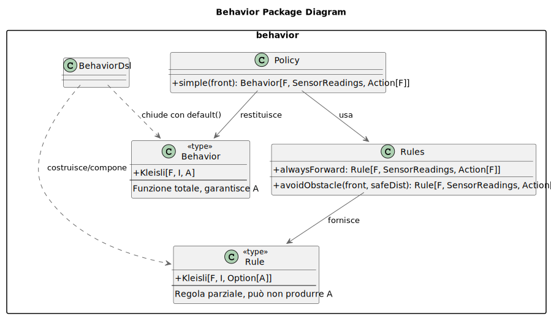

# Behavior

Il package `behavior` è il **motore decisionale**: a partire da un input `I` (nel nostro caso le letture dei sensori)
calcola l’**azione** `A` da eseguire su entità dinamiche (i `Robot`). L'obiettivo è di separare:

- **regole**: piccole condizioni locali (*parziali*);
- **comportamenti**: composizioni *totali* con fallback chiaro;
- **politiche**: builder riutilizzabili che assemblano comportamenti “pronti”.

In più un **DSL espressivo** per definire regole, priorità e fallback, restando agnostici rispetto
all’effetto.

## Panoramica e concetti

- **Condition[I]** → predicato su `I` (applicato ai `SensorReadings`: vedi [Sensori](./04-entity.md#sensori)).
- **Rule** (*parziale*): `Rule[F, I, A] = Kleisli[F, I, Option[A]]`: se la condizione non è soddisfatta ⇒ `None`.
- **Behavior** (*totale*): `Behavior[F, I, A] = Kleisli[F, I, A]`: si ottiene componendo più `Rule` e chiudendo con
  `default(...)`.
- **Policy** (*ricetta*): costruisce un `Behavior` partendo da regole e parametri.

> In breve: **Rule** = mattone decisionale *parziale* · **Behavior** = composizione *totale* con default · **Policy** =
> costruttore di `Behavior` pronti.

## Kleisli

Usiamo `Kleisli[F, I, A]` come shorthand di **`I => F[A]`**.
Le **Rule** producono `Option[A]` (possono non dare un’azione), i **Behavior** invece **garantiscono** sempre un’azione
grazie al fallback.

### Architettura del package



Tutto vive in `io.github.srs.model.entity.dynamicentity.behavior`.

* **BehaviorTypes**: alias di tipo (`Behavior`, `Rule`, `Condition`, e l’utility `always`).
* **Rules**: regole utili per comporre e testare i comportamenti. Alcuni esempi semplici:
    - `avoidObstacle(front, safeDist)`: se il sensore **frontale** (valore normalizzato ∈ `[0,1]`, dove `0` = vicino) è
      `< safeDist` ⇒ propone `turnRight`.
    - `alwaysForward`: proposta di `moveForward` come marcia base.

* **Policy**: builder di comportamenti comuni. Un esempio:
    - `Policy.simple(front)`: evita ostacoli frontali, altrimenti va avanti; fallback `NoAction`.

- **dsl**: mini linguaggio per comporre in modo naturale:
    - `cond ==> action` (crea una `Rule`), `r1 | r2` (fallback), `rules.default(fallback)` (chiusura in `Behavior`)
    - `rule.onlyIf(...)`, `rule.mapAction(...)`
    - Operatori su sensori: `front < t`, `front > t`
    - Composizione condizioni: `and`, `or`, `not`

### Flusso di esecuzione

1. Il robot legge i sensori: `r.senseAll[F](env): F[SensorReadings]`.
2. Il **Behavior** elabora quelle letture e produce un’`Action[F]`.
3. L’azione viene eseguita via `ActionAlg[F, Robot]` e applicata dagli attuatori (
   vedi [Attuatori](./04-entity.md#attuatori)).

## Esempio (DSL)

Una policy minima che evita l’ostacolo davanti, prova a girare se serve e altrimenti avanza; chiudiamo con un fallback
sicuro:

```scala
((front < 0.30) ==> turnRight[F]) |
  ((left < 0.25) ==> turnRight[F]) |
  ((right < 0.25) ==> turnLeft[F]) |
  Rules.alwaysForward[F]
    .default(stop[F])
```