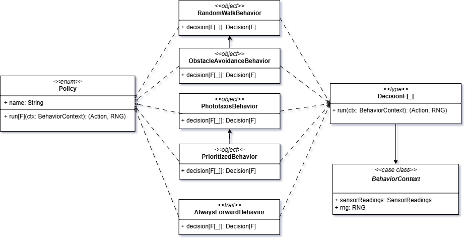

# Behavior

Il modulo `Behavior` è il **motore decisionale** del ciclo **sense → decision → act**.

Riceve le **letture sensoriali** (`SensorReadings`) e produce l'**intenzione** (l’`Action`) da applicare a un'entità
dinamica (es. `Robot`), mantenendo una separazione netta tra decisione ed esecuzione.

## Posizionamento nel ciclo di simulazione

1. **Sense**:  il robot acquisisce informazioni dall'ambiente tramite i sensori (`SensorReadings`);
2. **Decision**: il `Behavior` elabora il contesto e sceglie un’azione appropriata;
3. **Act**: l’azione viene interpretata dagli attuatori che modificano lo stato dell’entità.

> Il behavior è **stateless** (decisione _cieca_ sul tick corrente).  
> Se servisse “memoria”, bisognerebbe **estendere il contesto di input**  invece di introdurre mutazioni.

## I/O e contratti

Il sistema di behavior opera su dati strutturati che incapsulano tutte le informazioni necessarie:

- **Input** (`BehaviorContext`):
    - `sensorReadings: SensorReadings`: letture sensoriali correnti;
    - `rng: RNG`: generatore pseudo-casuale per comportamenti stocastici e riproducibili.
- **Output** → **Decision**`(Action[F], RNG)`:
    - `Action[F]` da eseguire sull’entità;
    - `RNG`: stato del generatore aggiornato.

> Invariante fondamentale: un behavior deve sempre produrre un'azione valida, garantendo la totalità della funzione
> decisionale.

## Astrazione dei comportamenti

Il modello si basa su quattro livelli di astrazione crescente:

- **Condition**: _predicati_ che valutano lo stato sensoriale (es. soglie/relazioni);
- **PartialBehavior**: regole che possono _proporre_ `A` (`Some`) o defers (`None`);
- **Behavior** – composizione di regole con  _fallback_ garantito per assicurare totalità (sempre un’azione `A`);
- **Policy** – strategie complete e riusabili per casi d'uso specifici (evita ostacoli, fototassi, ecc.).

## Panoramica tra Policy e Behavior

Il diagramma seguente sintetizza le relazioni tra `Policy`, i behavior concreti, `Decision[F]` e `BehaviorContext`.



## DSL di composizione

Il modulo fornisce un linguaggio specifico di dominio per comporre comportamenti in modo dichiarativo:

```scala
// Esempio: evitamento ostacoli con fallback
((front < 0.30) ==> turnRight[F]) |
  ((left < 0.25) ==> turnRight[F]) |
  ((right < 0.25) ==> turnLeft[F])
    .default(moveForward[F])
````

Il DSL supporta:

- Composizione left-biased con priorità esplicite;
- Operatori logici per condizioni complesse;
- Fallback garantiti per totalità.

## Politiche predefinite

Sono incluse un insieme di politiche standard che coprono i casi d'uso più comuni:

| Policy                | Descrizione                          | Caso d'uso                  |
|-----------------------|--------------------------------------|-----------------------------|
| **AlwaysForward**     | Movimento costante in avanti         | Testing, comportamento base |
| **RandomWalk**        | Esplorazione stocastica              | Copertura spaziale          |
| **ObstacleAvoidance** | Evitamento ostacoli multi-livello    | Navigazione sicura          |
| **Phototaxis**        | Attrazione verso sorgenti luminose   | Comportamento biologico     |
| **Prioritized**       | Composizione gerarchica di strategie | Comportamenti complessi     |

## Estensibilità

Il sistema è progettato per facilitare l'aggiunta di nuovi comportamenti.

1. _Nuove condizioni_: estendere i predicati per nuovi tipi di sensori.
2. _Nuove azioni_: aggiungere azioni al catalogo disponibile.
3. _Nuove policy_: comporre comportamenti esistenti o crearne di completamente nuovi.
4. _Nuovi contesti_: se necessario, estendere `BehaviorContext` per informazioni aggiuntive (es. memoria).

Per i dettagli tecnici di implementazione, consultare la
sezione [implementazione behavior](../05-implementation/03-david-cohen/behavior.md).