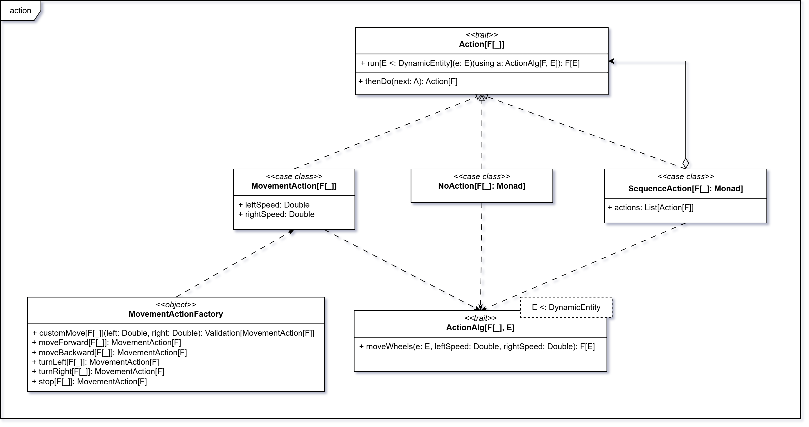

# Action

Per la modellazione della tipologia di azioni che è possibile svolgere dalle entità dinamiche è stato adottato un
approccio basato sul pattern **Tagless Final**, che consente di definire in maniera astratta e composabile i
comportamenti applicabili a un’entità senza vincolarsi a una specifica implementazione.

Il trait `Action[F[_]]` rappresenta un’azione generica parametrizzata sul tipo di effetto `F[_]`, in modo da poter
essere eseguita in contesti differenti. L’esecuzione dell’azione è demandata a un’interfaccia separata,
`ActionAlg[F, E]`, che definisce l’algebra delle operazioni disponibili su un’entità dinamica `E` che deve
estendere `DynamicEntity`.
In questo modo si realizza una netta distinzione tra cosa può essere fatto (la definizione dell’azione) e come viene
fatto (la sua interpretazione concreta).

Al momento, `ActionAlg[F, E]` definisce un singolo metodo:

- `moveWheels`, che consente di applicare velocità diverse alle ruote dell’entità dinamica, permettendo così di
  controllarne il movimento.

In futuro, questa interfaccia potrà essere estesa per includere ulteriori tipologie di azioni.

Sono state poi definite diverse implementazioni di `Action`:

- `MovementAction`: che rappresenta un movimento applicando velocità diverse alle ruote;
- `NoAction`: che lascia inalterata l’entità;
- `SequenceAction`: che permette di comporre più azioni in sequenza, garantendo un’esecuzione ordinata e monadica.

A supporto è stato introdotto anche l’oggetto `MovementActionFactory`, che fornisce un insieme di azioni predefinite
(avanti, indietro, svolta a sinistra/destra, stop) e un metodo per la creazione di movimenti personalizzati con
validazione sui parametri di velocità.