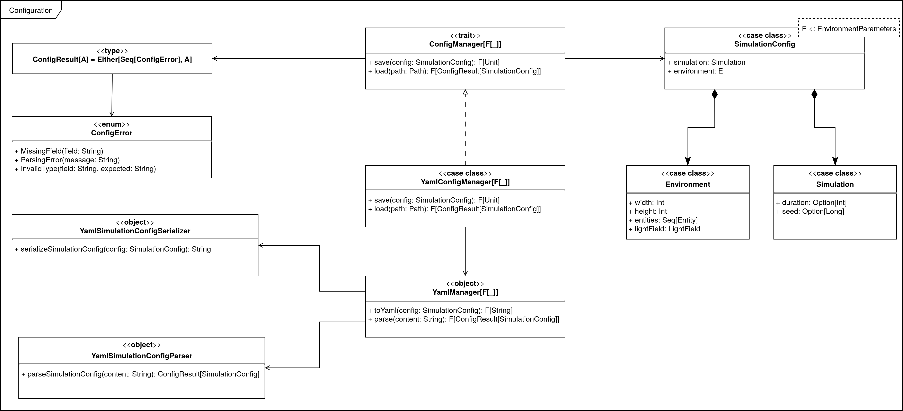

# Configuration

Il package `io.github.srs.config` fornisce le classi necessarie per gestire la configurazione della simulazione.
Viene utilizzata per permettere di salvare e caricare le impostazioni della simulazione, come ad esempio il `seed` e la durata della simulazione, oltre a configurare le caratteristiche dell'ambiente di simulazione, ovvero la dimensione e il numero di entità presenti.
Le operazioni di salvataggio e caricamento sono gestite dal _trait_ `ConfigManager`, un'interfaccia agnostica che permette di gestire la configurazione in modo indipendente dal formato di salvataggio.

> Nota: al momento è possibile utilizzare solamente il formato _YAML_.
> Le operazioni che vengono effettuate sono le seguenti:

- caricamento (`load`) della configurazione da un file _YAML_;
- salvataggio (`save`) della configurazione su un file _YAML_.

Durante l'esecuzione della funzione `load`, viene effettuato un controllo sulla validità della configurazione, per garantire che i parametri siano corretti e che non vi siano errori di formattazione o valori non validi.

## Architettura

L'architettura di `ConfigManager` adotta un approccio _funzionale e parametrico_ basato su `F[_]`, rendendo il codice agnostico rispetto all'effetto utilizzato per l'esecuzione (es. `IO`, `SyncIO`, `Task`).

L'implementazione prevede:

- `ConfigManager[F[_]]`: un'interfaccia che definisce le operazioni di caricamento e salvataggio della configurazione (_algebra_);
- `YamlConfigManager[F[_]]`: un'implementazione di `ConfigManager` che utilizza il formato _YAML_ per la configurazione (_interprete_);
- utility di parsing e serializzazione (`YamlManager`, `YamlSimulationConfigParser`, `YamlSimulationConfigSerializer`): gestiscono la conversione tra oggetti Scala e rappresentazioni _YAML_;
- `ConfigError` e `ConfigResult[A]`: tipi per gestire gli errori di configurazione e i risultati delle operazioni di caricamento e salvataggio.

### Tagless Final Pattern

Il `ConfigManager[F[_]]` segue il **Tagless Final Pattern**: le operazioni sono parametrizzate su un tipo di effetto `F[_]` e vincolate solo alle capacità necessarie, ad esempio `Sync` e `Files` per `YamlConfigManager[F[_]]`.
I vincoli di tipo (`cats.effect.Sync` e `fs2.Files`) definiscono le capacità richieste - sospendere side-effect e interagire con il file system - senza imporre implementazioni concrete.

A differenza di [Action](./07-action.md), non è stata suddivisa l'algebra dall'interfaccia, ma saranno le diverse implementazioni a fornire le concrete realizzazioni delle operazioni.  
In questo contesto si distinguono quindi:

- **algebra**: il trait `ConfigManager`, che definisce le operazioni disponibili senza specificare come debbano essere implementate;
- **interpreti**: le varie implementazioni concrete dell’algebra. Ad esempio `YamlConfigManager[F]` interpreta le operazioni leggendo e scrivendo file YAML, mentre in futuro potrebbero esserci interpreti diversi (es. `JsonConfigManager[F]` o un interprete in-memory per i test).

Questo approccio consente:

- indipendenza dal tipo di effetto specifico utilizzato per l'esecuzione;
- migliore testabilità tramite interpreti fittizi o mock;
- separazione netta tra la definizione dell'algebra (`ConfigManager`) e le implementazioni concrete (_interpreti_ come `YamlConfigManager`).

## Gestione degli Errori

La gestione degli errori durante il caricamento della configurazione è stata gestita tramite il tipo `ConfigResult[A]` (alias per `Either[Seq[ConfigError], A]`).
Rappresenta il risultato di un'operazione di configurazione e può essere un successo (`Right`) o un fallimento (`Left`).

I tipi di errore sono definiti in `ConfigError`, che include:

- `MissingField`: un campo obbligatorio mancante;
- `ParsingError`: un errore durante il parsing del file di configurazione, tipicamente causato dall'utilizzo di chiavi non valide;
- `InvalidType`: un tipo di dato non valido per un campo specifico.

:::info

I dettagli implementativi riguardanti la configurazione sono disponibili nella sezione [Implementazione della configurazione](../05-implementation/02-simone-ceredi/4-configuration.md).

:::
