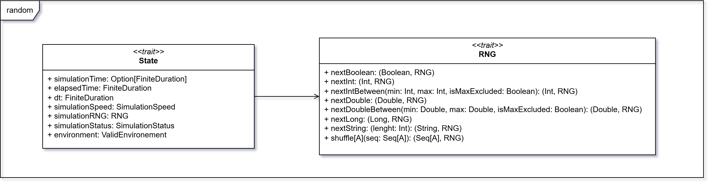

# Generatore di numeri casuali

Per l’implementazione del generatore di numeri casuali (`RNG`) e del tipo funzionale `Rand[A]`, ci si è ispirati al
**Capitolo 6** del libro [**Functional Programming in Scala**](https://www.manning.com/books/functional-programming-in-scala-second-edition), che illustra come costruire generatori casuali puri e componibili
in uno stile funzionale.

## RNG

`RNG` è un generatore di numeri casuali basato su `scala.util.Random`, che fornisce metodi per generare numeri casuali
in modo funzionale puro.

Principali caratteristiche:

- i metodi accettano un parametro `rng: RNG`, rappresentante lo stato corrente del generatore;
- ogni metodo restituisce una tupla `(A, RNG)`, dove `A` è il valore casuale generato e `RNG` il nuovo stato del
  generatore;
- lo stato interno non viene modificato (non ci sono effetti collaterali), ma ogni operazione produce un nuovo `RNG`;

Supporta la generazione di booleani, interi, double, long, stringhe e sequenze casuali.

## Rand

`Rand[A]` è un tipo funzionale definito come `RNG => (A, RNG)`.
Permette di comporre e trasformare generatori casuali in modo dichiarativo.

## RandomDSL

`RandomDSL` fornisce una sintassi ad alto livello per creare generatori leggibili e componibili.
