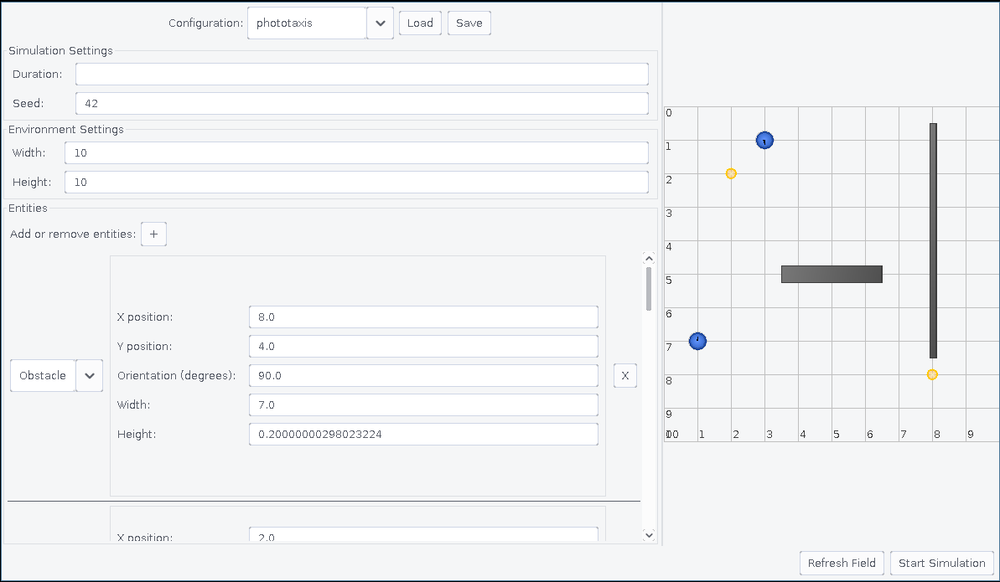

# Configurazione

<!-- TODO: Con windows vengono più belli gli screenshots :) -->

Il menu a tendina "Configuration" consente di selezionare diverse configurazioni predefinite.
Il pulsante "Load" permette di caricare una configurazione personalizzata da file "YAML".
Tramite il pulsante "Save" è possibile salvare la configurazione attuale in un file "YAML".

Nella schermata di configurazione è possibile impostare i seguenti parametri:

- Durata della simulazione
- Seed della simulazione (per garantire la ripetibilità dei risultati)
- Dimensioni dell'ambiente di simulazione
- Entità statiche presenti nell'ambiente (es. ostacoli, luci)
- Robot presenti nell'ambiente (posizione, dimensione, comportamento, sensori)

Per avere una preview della configurazione attuale è possibile utilizzare il pulsante "Refresh Field".

Premendo il tasto "Start Simulation" verrà verificata la configurazione attuale e, se valida, verrà avviata la simulazione; in caso contrario verrà mostrato un messaggio di errore che indica quali parametri non sono stati impostati correttamente.
