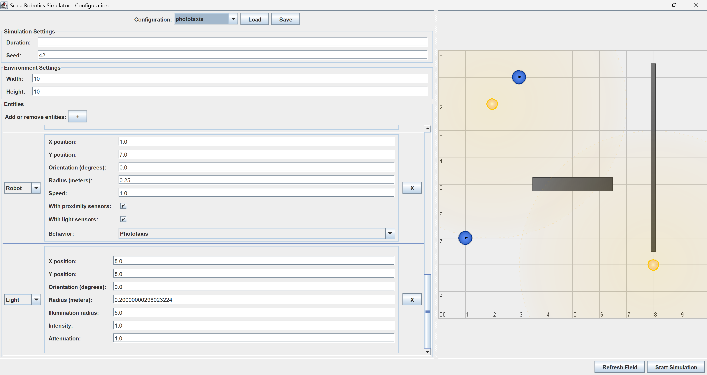

# Configurazione

Il menù a tendina **`Configuration`** consente di selezionare diverse configurazioni predefinite.  
Sono inoltre disponibili i seguenti pulsanti:

- **`Load`** — carica una configurazione personalizzata da file in formato _YAML_.
- **`Save`** — salva la configurazione attuale in un file _YAML_.

## Parametri configurabili

La schermata di configurazione è suddivisa in aree dedicate:

- **Parametri della simulazione**
    - **`Durata`** — tempo totale di esecuzione in millisecondi (lasciato vuoto la simulazione è infinita);
    - **`Seed`** — per garantire la ripetibilità dei risultati;

- **Caratteristiche dell’ambiente**
    - **`Dimensioni`** — altezza e larghezza dell’area di simulazione;

- **Entità presenti nell’ambiente**  
  Tutte le entità sono definite da: posizione (coordinate *x*, *y*) e orientamento (in gradi, 0° verso destra,
  90° verso l’alto).
  Parametri specifici:
    - **`Ostacoli`** — dimensioni (larghezza e altezza);
    - **`Luci`** — raggio (in metri), raggio di illuminazione, intensità, attenuazione;
    - **`Robot`** — raggio (in metri), velocità (valida per entrambe le ruote, valore incluso tra -1.0 e 1.0), sensori (
      prossimità, luce) attivabili/disattivabili tramite _checkbox_, comportamento selezionabile da menu
      a tendina.

## Anteprima e avvio

- Con il pulsante **`Refresh Field`** è possibile visualizzare un’anteprima della configurazione attuale.
- Premendo **`Start Simulation`**, il sistema verifica la configurazione:
    - se valida, la simulazione viene avviata;
    - in caso di errori, viene mostrato un messaggio che indica quali parametri non sono stati impostati correttamente.  
