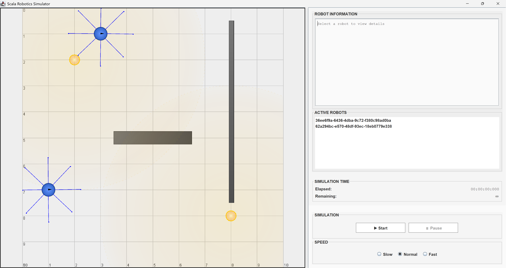
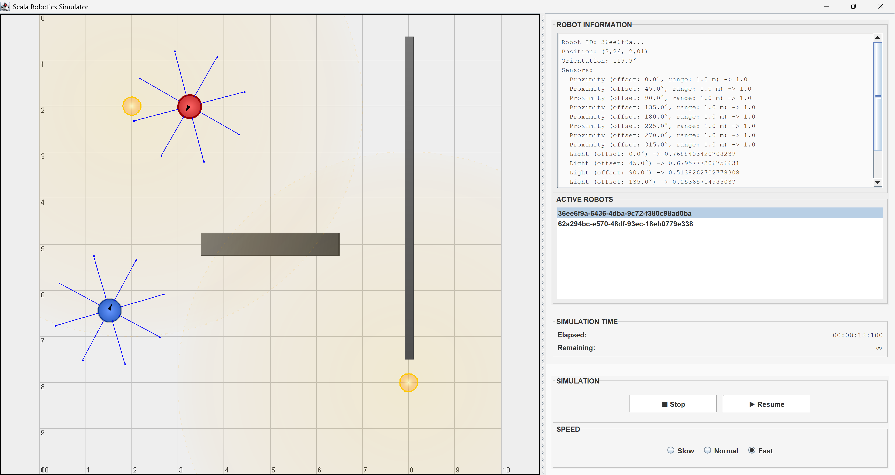
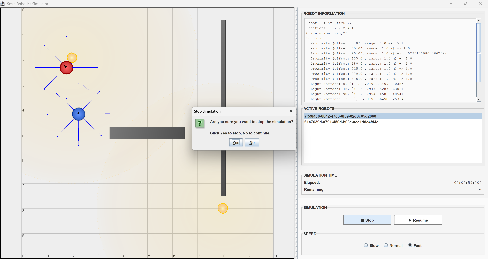

# Simulazione

La schermata di simulazione mostra l’ambiente virtuale in cui i robot interagiscono.  
È possibile osservare il loro comportamento in tempo reale e analizzare i risultati della simulazione.

## Stato della simulazione

### Griglia di simulazione

La griglia di simulazione occupa la gran parte della schermata a sinistra. Qui vengono visualizzati i robot e l’ambiente in
cui si muovono (compreso di ostacoli e luci). Rappresenta lo stato attuale della simulazione.

### Tempo di simulazione

A destra è presente il **`tempo della simulazione`**, mostrato come tempo:

- **rimanente**, se specificato nella configurazione;
- **trascorso**, fino a quel momento.

### Active Robots

Attraverso il menù **`Active Robots`** è possibile selezionare un robot durante l'esecuzione della simulazione e
consultare le relative informazioni:

- **Id**
- **Posizione** (coordinate _x_, _y_)
- **Direzione** (angolo in gradi)
- **Letture dei sensori di prossimità**
- **Letture dei fotosensori**

## Controlli della simulazione

- **Controlli di esecuzione** — la simulazione può essere messa in pausa, ripresa o interrotta in qualsiasi momento;
- **Velocità di riproduzione** — disponibili tre modalità, per adattare l’esecuzione alle esigenze dell’utente.

### Simulazione in pre-avvio

La simulazione non è avviata finché l’utente non preme il pulsante di **`► Start`**.

### Simulazione in pausa

Una volta avviata, la simulazione può essere messa in pausa in qualsiasi momento premendo il pulsante di **`❚❚ Pause`**.
Può essere ripresa premendo il pulsante di **`► Resume`**.

### Simulazione stoppata

La simulazione può essere interrotta in qualsiasi momento premendo il pulsante **`■ Stop`**.  
In questo caso viene presentata una **richiesta di conferma all’utente** prima di procedere con l’interruzione.

