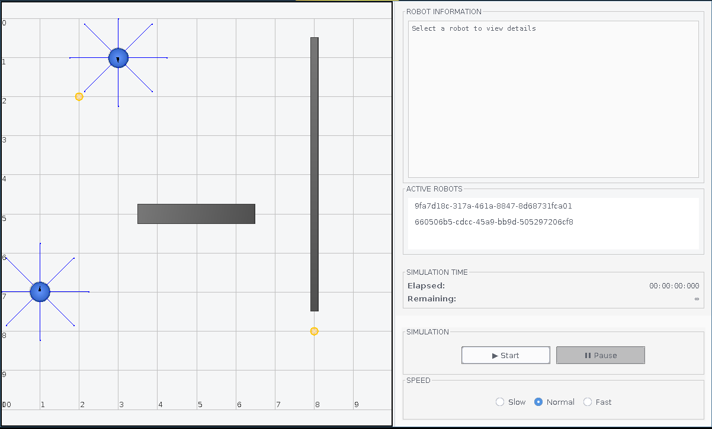

# Simulazione

<!-- TODO: Con windows vengono più belli gli screenshots :) -->

La schermata di simulazione mostra l'ambiente virtuale in cui i robot interagiscono. È possibile osservare il comportamento dei robot in tempo reale e analizzare i risultati della simulazione.

Sulla sinistra viene mostrato lo stato attuale della simulazione.

È possibile mettere in pausa, riprendere o fermare la simulazione in qualsiasi momento.
3 diverse velocità di riproduzione sono disponibili per adattarsi alle esigenze dell'utente.

Attraverso il menu "Active Robots" è possibile selezionare un robot del quale osservare le informazioni, quali:

- Id
- Posizione
- Direzione
- Letture dei sensori di prossimità
- Letture dei fotosensori
